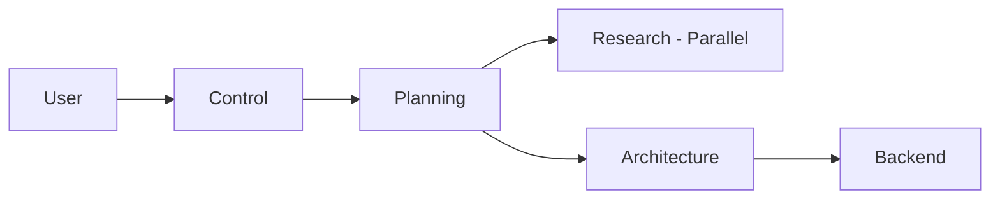
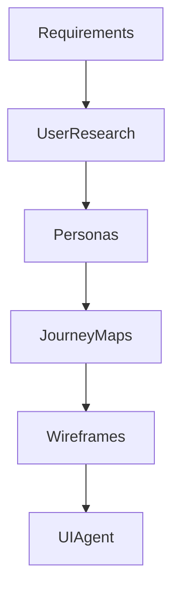
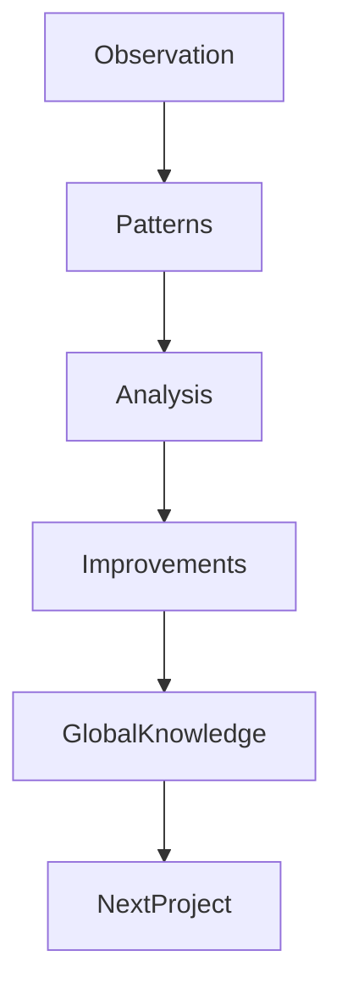
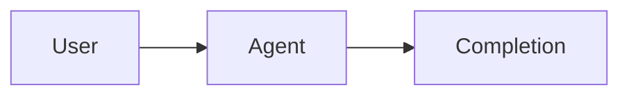
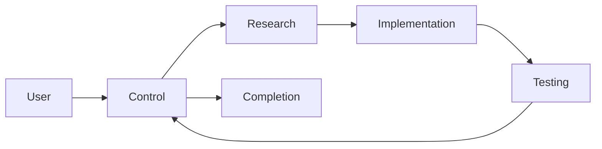
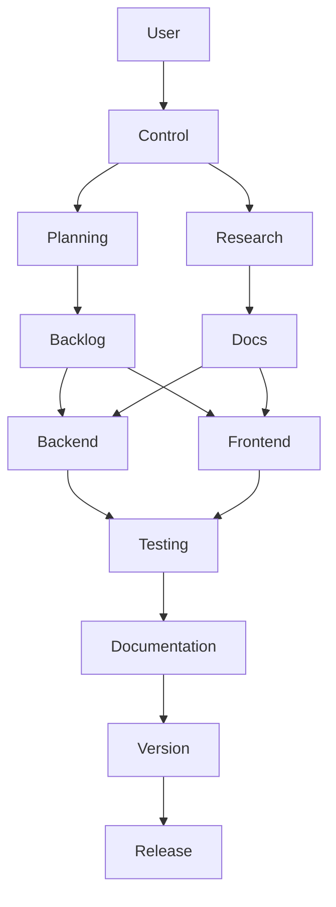

# Agent Reference

## Complete Agent Capability Matrix

| Agent | Primary Role | Tools Access | Coordination | Commit Frequency |
|-------|-------------|--------------|--------------|------------------|
| **Control Agent** | Orchestration & Quality Gates | Full Access [`*`] | Coordinates all agents | Per milestone |
| **Planning Agent** | Strategic Planning & Architecture | Full Access [`*`] | First in workflow | Every 30-60 min |
| **Research Agent** | Documentation & Best Practices | Firecrawl MCP + Standard | Parallel with Planning | After deliverables |
| **UX Agent** | User Experience Design | Read-only Tools | Before UI Agent | After designs |
| **UI Agent** | React/TypeScript Implementation | Development Tools | After UX/Backend | Every 30-60 min |
| **Backend Agent** | API & Database Development | Development Tools | Before Frontend | Every 30-60 min |
| **Testing Agent** | Quality Assurance | Testing Tools | After Implementation | After test suites |
| **Documentation Agent** | Technical Documentation | Read/Write Tools | Continuous | After sections |
| **Version Control Agent** | Git Operations | Git Tools | End of workflow | Per operation |
| **Improvement Agent** | Continuous Learning | Observation Tools | Always Active | Post-project |
| **Bootstrap Agent** | Project Initialization | Read/Write/Template | Start of project | After setup |
| **General Purpose** | Complex Multi-step Tasks | As Needed | Variable | As needed |

## Agent Interaction Patterns

### 1. Control Agent (Orchestrator)

**Role**: SCRUM master and orchestrator for all multi-agent workflows

**Key Responsibilities**:
- Analyzes user requests to determine complexity
- Delegates tasks to specialized agents (NEVER executes directly)
- Monitors progress and coordinates handoffs
- Enforces quality gates and confidence thresholds (>99%)
- Validates completion of all agent work

**Invocation Patterns**:
```text
# Automatic for complex tasks
"Build a user authentication system"  → Control activates automatically

# Explicit invocation
"Use the control-agent to coordinate building [feature]"
```

**Communication Protocol**:
- All agents report to control-agent before/during/after work
- Control-agent authorizes agent activities
- Manages conflicts and dependencies
- Ensures commit frequency compliance

### 2. Planning Agent (Strategist)

**Role**: Strategic project planning using Claude Opus 4

**Key Responsibilities**:
- Creates project briefs and requirements
- Designs system architecture
- Develops task backlogs and dependencies
- Allocates work to appropriate agents
- Establishes success criteria

**Workflow Integration**:


**Deliverables**:
- Project brief with scope and objectives
- Technical architecture document
- Sprint backlogs with task breakdowns
- Dependency graphs
- Risk assessments

### 3. Research Agent (Investigator)

**Role**: Documentation research specialist using Firecrawl MCP

**Key Responsibilities**:
- Researches technical documentation
- Investigates best practices
- Analyzes API documentation
- Evaluates framework capabilities
- Provides findings to implementation agents

**MCP Integration**:
```text
# Automatic activation
"How do I implement OAuth in Next.js?"  → Research agent activates

# Uses Firecrawl MCP tools:
- firecrawl_scrape: Direct page scraping
- firecrawl_search: Web search with scraping
- firecrawl_map: URL discovery
- firecrawl_deep_research: Comprehensive analysis
```

**Research Workflow**:
1. Receives research request from control-agent
2. Queries documentation sources
3. Synthesizes findings
4. Reports to implementation agents
5. Commits research deliverables

### 4. UX Agent (Designer)

**Role**: User experience design specialist

**Key Responsibilities**:
- Creates user journey maps
- Designs wireframes and workflows
- Ensures WCAG 2.1 AA accessibility
- Develops information architecture
- Validates usability patterns

**Design Process**:


**Accessibility Standards**:
- Color contrast ratios (4.5:1 minimum)
- Keyboard navigation support
- Screen reader compatibility
- ARIA labels and roles
- Focus management

### 5. UI Agent (Frontend Developer)

**Role**: React/TypeScript implementation specialist

**Key Responsibilities**:
- Implements React components
- Integrates with backend APIs
- Applies Tailwind CSS styling
- Ensures >90% test coverage
- Manages component state

**Technology Stack**:
- React 18+ with hooks
- TypeScript for type safety
- Tailwind CSS for styling
- Vitest for unit testing
- Storybook for component documentation

**Component Standards**:
```typescript
// Example component structure
interface ComponentProps {
  // Strongly typed props
}

export const Component: FC<ComponentProps> = (props) => {
  // Implementation with hooks
  // Accessibility attributes
  // Error boundaries
  // Test coverage >90%
}
```

### 6. Backend Agent (API Developer)

**Role**: Firebase and state management specialist

**Key Responsibilities**:
- Designs database schemas
- Implements API endpoints
- Manages authentication/authorization
- Handles state management (Zustand)
- Ensures data validation

**Firebase Integration**:
- Firestore for NoSQL database
- Firebase Auth for authentication
- Cloud Functions for serverless APIs
- Security rules for access control
- Real-time listeners for updates

**API Patterns**:
```typescript
// Type-safe API with validation
export const createEndpoint = async (data: ValidatedInput): Promise<Result> => {
  // Input validation
  // Authentication check
  // Business logic
  // Error handling
  // Response formatting
}
```

### 7. Testing Agent (QA Specialist)

**Role**: Quality assurance and testing specialist

**Key Responsibilities**:
- Creates comprehensive test suites
- Ensures >90% code coverage
- Implements E2E tests
- Validates accessibility
- Performance testing

**Testing Stack**:
- Vitest for unit tests
- Playwright for E2E tests
- Testing Library for component tests
- Storybook for visual tests
- Lighthouse for performance

**Test Categories**:
1. **Unit Tests**: Individual functions/components
2. **Integration Tests**: Module interactions
3. **E2E Tests**: User workflows
4. **Accessibility Tests**: WCAG compliance
5. **Performance Tests**: Load and speed

### 8. Documentation Agent (Technical Writer)

**Role**: Comprehensive documentation specialist

**Key Responsibilities**:
- Maintains API documentation
- Updates architecture docs
- Creates developer guides
- Documents deployment procedures
- Manages changelog

**Documentation Types**:
- **API Reference**: Endpoints, parameters, responses
- **Developer Guides**: Setup, configuration, usage
- **Architecture Docs**: System design, patterns
- **User Guides**: Feature documentation
- **Troubleshooting**: Common issues, solutions

### 9. Version Control Agent (Git Specialist)

**Role**: Git operations and release management

**Key Responsibilities**:
- Manages branching strategies
- Creates meaningful commits
- Handles pull requests
- Coordinates releases
- Maintains clean history

**Git Workflow**:
```bash
# Feature branch workflow
main → feature/[name] → PR → review → merge

# Commit message format
type(scope): description

# Types: feat, fix, docs, style, refactor, test, chore
```

**Release Management**:
- Semantic versioning (MAJOR.MINOR.PATCH)
- Changelog generation
- Tag creation
- Release notes
- Deployment coordination

### 10. Improvement Agent (Learner)

**Role**: Dual-layer optimization specialist

**Two-Layer Architecture**:

**Project Layer (Sonnet)**:
- Continuous real-time observation
- Pattern recognition
- Activity logging
- Performance metrics
- Issue identification

**Meta Layer (Opus)**:
- Post-project deep analysis
- Cross-project learning
- Best practice extraction
- Improvement recommendations
- Knowledge base updates

**Learning Process**:


### 11. Bootstrap Agent (Initializer)

**Role**: Project initialization and setup specialist

**Key Responsibilities**:
- Analyzes repository structure
- Creates comprehensive documentation
- Sets up Claude configurations
- Installs agent templates
- Configures project hooks

**Bootstrap Workflow**:
1. **Explore**: Scan repository structure
2. **Plan**: Generate action plan
3. **Execute**: Create docs and configs
4. **Summarize**: Report results

## Coordination Workflows

### Simple Task Flow

Example: "Format this code" → UI Agent formats directly

### Medium Complexity Flow

Example: "Add user authentication" → Coordinated multi-agent work

### Complex Project Flow

Example: "Build a complete e-commerce platform"

## Agent Communication Protocols

### Status Reports

#### Before Starting Work
```json
{
  "agent": "backend-agent",
  "action": "request_authorization",
  "task": "Implement user authentication API",
  "scope": ["Firebase Auth", "JWT tokens", "Role-based access"],
  "dependencies": ["research-agent findings", "database schema"],
  "estimated_time": "2 hours",
  "conflicts": []
}
```

#### Progress Update
```json
{
  "agent": "backend-agent",
  "action": "progress_update",
  "completed": ["Firebase Auth setup", "JWT middleware"],
  "current": "Implementing role-based access control",
  "next": "Testing authentication flows",
  "blockers": [],
  "commits": ["feat(auth): add Firebase Auth integration"],
  "eta": "30 minutes"
}
```

#### Completion Report
```json
{
  "agent": "backend-agent",
  "action": "completion_report",
  "deliverables": ["Auth API endpoints", "Security rules", "JWT handling"],
  "files_changed": ["src/api/auth.ts", "firestore.rules"],
  "commits": ["feat(auth): complete authentication system"],
  "tests": "All passing (95% coverage)",
  "ready_for": "frontend-agent integration",
  "issues": []
}
```

## Quality Gates

### Confidence Thresholds
- **99%+ Required**: Production deployments
- **95%+ Required**: Feature completion
- **90%+ Required**: Test coverage
- **85%+ Warning**: Technical debt threshold

### Validation Checkpoints
1. **Planning → Implementation**: Architecture approved
2. **Backend → Frontend**: APIs tested and documented
3. **Implementation → Testing**: Features complete
4. **Testing → Documentation**: All tests passing
5. **Documentation → Release**: Docs complete

## Best Practices

### Agent Selection
- **Single file change**: Direct agent work
- **Feature addition**: Control + 2-3 agents
- **New project**: Full agent suite with bootstrap
- **Bug fix**: Specific agent + testing
- **Documentation**: Documentation agent only

### Parallel Execution
Agents that can work in parallel:
- Planning + Research
- Backend + Frontend (after interfaces defined)
- Documentation (continuous)
- Improvement (always observing)

### Sequential Dependencies
Must be sequential:
- Architecture → Implementation
- Implementation → Testing
- Testing → Release
- API Development → Frontend Integration

## Troubleshooting Agents

### Agent Not Responding
```text
# Check agent availability
/agents

# Explicitly invoke
"Use the [agent-name] to [task]"
```

### Agent Conflicts
```text
# Control-agent resolves conflicts
"Control-agent, resolve conflict between backend and frontend agents"
```

### Quality Gate Failures
```text
# Re-run with specific agent
"Testing-agent, validate the authentication implementation"
```

## Advanced Agent Usage

### Custom Agent Creation
Add new agents in `~/.claude/agents/custom-agent.md`:
```yaml
---
name: custom-agent
description: Specialized for specific domain
tools: ["Read", "Write", "Edit"]
---

# Custom Agent Instructions
...
```

### Agent Composition
Combine agents for complex workflows:
```text
"Use planning-agent for architecture, then coordinate backend-agent and ui-agent for implementation, with testing-agent validation"
```

### Domain-Specific Agents
Create specialized agents for your domain:
- **Data Science Agent**: Python, Jupyter, ML libraries
- **DevOps Agent**: Docker, Kubernetes, CI/CD
- **Mobile Agent**: React Native, Flutter
- **Game Dev Agent**: Unity, Unreal, Graphics

## Related Documentation

- [Bootstrap Guide](./bootstrap-guide.md) - Project initialization
- [Architecture](./architecture.md) - System design
- [Troubleshooting](./troubleshooting.md) - Common issues
- [Testing](./testing.md) - Quality assurance