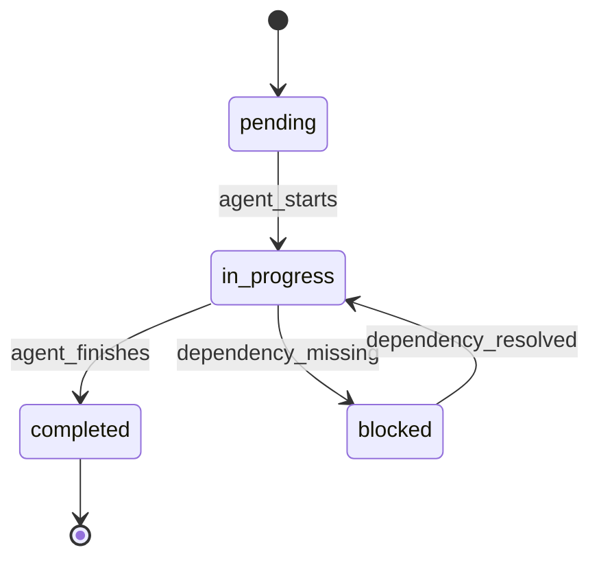

## API Reference

### System Interfaces

There are no network APIs (REST/GraphQL/RPC) provided by this repository. All interfaces are file-based and command-based.

#### File-Based Interfaces

1. **Agent Specifications**
   - Location: `agents/*.md`
   - Format: YAML frontmatter + Markdown
   - Structure:
     ```yaml
     ---
     name: agent-name
     description: Agent purpose
     tools: ["Tool1", "Tool2", "*"]
     ---
     # Agent Instructions
     ```

2. **Task Ledgers**
   - Location: `ledgers/*.json`
   - Format: JSON state machines
   - Schema:
     ```json
     {
       "tasks": [{
         "id": "string",
         "status": "pending|in_progress|completed",
         "agent": "string",
         "dependencies": ["task-id"],
         "timestamp": "ISO-8601"
       }]
     }
     ```

3. **Observation Logs**
   - Location: `observation/*.json`
   - Format: Event stream JSON
   - Pattern recognition data

#### Command Interfaces

##### Global Slash Commands

###### `/bootstrap`
Bootstrap command for project initialization.

**Syntax**:
```text
/bootstrap [flags] [notes]
```

**Parameters**:
| Flag | Type | Description |
|------|------|-------------|
| `--docs-only` | boolean | Only create/update documentation |
| `--bootstrap-only` | boolean | Skip docs, only Claude assets |
| `--agents` | boolean | Include agent configurations |
| `--hooks` | boolean | Include safe hook scripts |
| `--yes` | boolean | Auto-approve changes |

**Response**: Markdown report with created/updated files

###### `/agents`
List all available agents.

**Syntax**:
```text
/agents
```

**Response**: List of agent names with descriptions

#### Agent Invocation Patterns

##### Direct Agent Invocation
```text
"[Agent-name], [task description]"
```

Example:
```text
"Documentation-agent, update the API documentation"
```

##### Control-Agent Coordination
```text
"Use the control-agent to coordinate [complex task]"
```

Example:
```text
"Use the control-agent to coordinate building a user authentication system"
```

##### Parallel Agent Execution
```text
"Have [agent1] and [agent2] work in parallel on [tasks]"
```

Example:
```text
"Have research-agent and planning-agent work in parallel on the new feature"
```

### External Integrations

#### Firecrawl MCP Integration

The Research Agent uses Firecrawl MCP for documentation scraping.

**Configuration**:
- API Key: Set `firecrawl-api-key` in `.env`
- Format: `fc-xxxxxxxxxxxxxxxxxxxxxxxxxxxxxxxx`
- Setup: Run `./setup-firecrawl-mcp.sh`

**Available MCP Tools**:
```javascript
// Scrape single page
firecrawl_scrape(url, formats, options)

// Search and scrape
firecrawl_search(query, limit, scrapeOptions)

// Discover URLs
firecrawl_map(url, limit, ignoreSitemap)

// Deep research
firecrawl_deep_research(query, maxDepth, maxUrls)

// Extract structured data
firecrawl_extract(urls, schema, prompt)
```

**Rate Limits**:
- Governed by Firecrawl service tier
- Default: 100 requests/minute
- No local rate limiting implemented

### Agent Communication Protocol

#### Message Format

Agents communicate using structured JSON messages:

```typescript
interface AgentMessage {
  agent: string;           // Agent identifier
  action: string;          // Action type
  payload: any;           // Action-specific data
  timestamp: string;      // ISO-8601 timestamp
  correlationId?: string; // For request-response pairing
}
```

#### Action Types

##### Request Authorization
```json
{
  "action": "request_authorization",
  "payload": {
    "task": "string",
    "scope": ["string"],
    "dependencies": ["string"],
    "estimated_time": "string"
  }
}
```

##### Progress Update
```json
{
  "action": "progress_update",
  "payload": {
    "completed": ["string"],
    "current": "string",
    "next": "string",
    "blockers": ["string"],
    "eta": "string"
  }
}
```

##### Completion Report
```json
{
  "action": "completion_report",
  "payload": {
    "deliverables": ["string"],
    "files_changed": ["string"],
    "commits": ["string"],
    "tests": "string",
    "ready_for": "string"
  }
}
```

### Hook System API

Hooks are bash scripts triggered by Claude Code events.

#### Hook Configuration
Location: `.claude/settings.json`

```json
{
  "hooks": {
    "pre-commit": "path/to/script.sh",
    "pre-push": "path/to/script.sh",
    "post-update": "path/to/script.sh"
  }
}
```

#### Hook Script Interface

Scripts receive environment variables:
- `$CLAUDE_PROJECT_ROOT` - Project root directory
- `$CLAUDE_AGENT` - Current agent name
- `$CLAUDE_TASK` - Current task description
- `$CLAUDE_FILES` - Modified files (space-separated)

Exit codes:
- `0` - Success, continue operation
- `1` - Failure, block operation
- `2` - Warning, continue with caution

### Template System API

Templates use variable substitution for project customization.

#### Template Variables

| Variable | Description | Example |
|----------|-------------|---------|
| `{{PROJECT_NAME}}` | Detected project name | "my-app" |
| `{{FRAMEWORK}}` | Primary framework | "React" |
| `{{LANGUAGE}}` | Primary language | "TypeScript" |
| `{{PACKAGE_MANAGER}}` | Package manager | "npm", "yarn", "pnpm" |
| `{{TEST_FRAMEWORK}}` | Test framework | "vitest", "jest" |
| `{{TIMESTAMP}}` | Current timestamp | "2024-01-20T10:30:00Z" |

#### Custom Template Creation

Add templates to `~/.claude/templates/`:
```
templates/
└── custom/
    ├── CLAUDE.md
    └── agents/
        └── custom-agent.md
```

### Ledger State Machine

Task ledgers follow a finite state machine:



#### State Transitions

| From | To | Trigger | Conditions |
|------|-----|---------|------------|
| `pending` | `in_progress` | Agent starts work | Dependencies met |
| `in_progress` | `completed` | Work finished | Tests pass |
| `in_progress` | `blocked` | Issue encountered | Missing dependency |
| `blocked` | `in_progress` | Issue resolved | Dependency available |

### Error Codes

System-specific error codes:

| Code | Description | Resolution |
|------|-------------|------------|
| `AGENT_001` | Agent not found | Check agent installation |
| `AGENT_002` | Agent permission denied | Review agent tools access |
| `MCP_001` | MCP not configured | Run setup-firecrawl-mcp.sh |
| `MCP_002` | API key invalid | Check .env configuration |
| `LEDGER_001` | Ledger corrupted | Restore from backup |
| `HOOK_001` | Hook script failed | Check script permissions |
| `BOOTSTRAP_001` | Template not found | Reinstall templates |

### Performance Metrics

System metrics tracked in observation logs:

```json
{
  "metrics": {
    "agent_response_time_ms": 250,
    "task_completion_time_s": 1800,
    "ledger_update_frequency_s": 30,
    "commit_frequency_minutes": 45,
    "test_coverage_percent": 92,
    "quality_gate_success_rate": 0.98
  }
}
```


