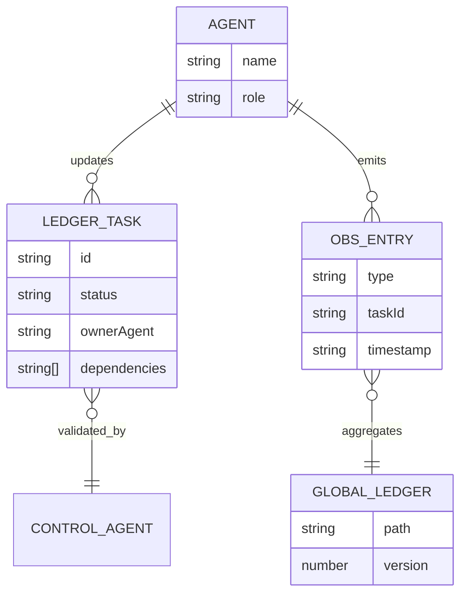

## Data Model

Datastores:
- File-based JSON ledgers in `ledgers/`
- Global observation ledger in `global-observation/`
- Activity and pattern recognition artifacts in `observation/`

Entities and relationships:

Migration/seed notes:
- No DB migrations. Ledgers are append-only JSON edited via normal VCS.

