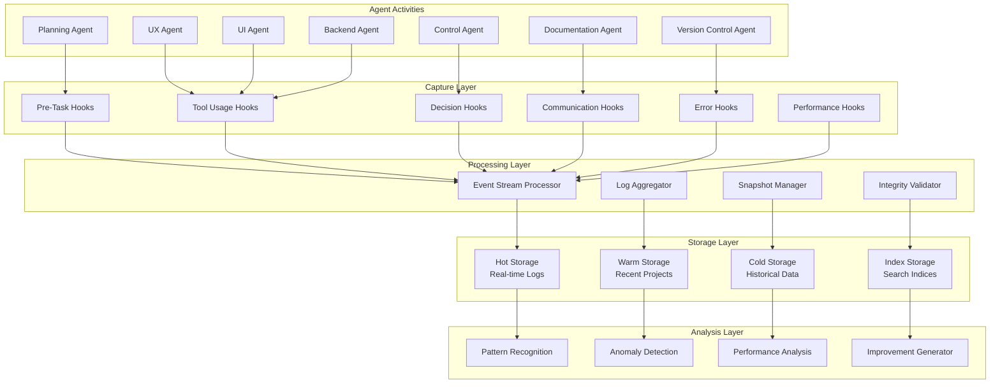

# Agent Activity Hooks - Observation Integration

## Overview
This document defines the integration points for comprehensive activity logging across all agents. These hooks ensure >99% capture accuracy without impacting agent performance.

## Universal Hook Implementation

### Pre-Task Hook
```typescript
// Automatically triggered when agent receives task from ledger
interface PreTaskHook {
  trigger: "task_assignment";
  capture: {
    agentId: string;
    taskId: string;
    taskDetails: any;
    dependencies: string[];
    estimatedDuration: number;
    assignedBy: string;
    timestamp: string;
  };
  storage: ".claude/observation/logs/[date]/pre-task/";
}
```

### Tool Usage Hook
```typescript
// Captures every tool invocation
interface ToolUsageHook {
  trigger: "tool_invocation";
  capture: {
    agentId: string;
    toolName: string;
    parameters: any;
    purpose: string;
    taskContext: string;
    timestamp: string;
    duration: number;
    result: "success" | "failure" | "partial";
  };
  storage: ".claude/observation/logs/[date]/tool-usage/";
}
```

### Decision Point Hook
```typescript
// Records significant decisions
interface DecisionHook {
  trigger: "decision_required";
  capture: {
    agentId: string;
    decisionType: string;
    options: string[];
    selectedOption: string;
    reasoning: string;
    confidenceLevel: number;
    alternativesConsidered: any[];
    timestamp: string;
  };
  storage: ".claude/observation/logs/[date]/decisions/";
}
```

### Communication Hook
```typescript
// Inter-agent message logging
interface CommunicationHook {
  trigger: "agent_communication";
  capture: {
    fromAgent: string;
    toAgent: string;
    messageType: "request" | "response" | "notification" | "escalation";
    content: any;
    relatedTask: string;
    priority: string;
    timestamp: string;
    acknowledged: boolean;
  };
  storage: ".claude/observation/logs/[date]/communications/";
}
```

### Error Capture Hook
```typescript
// Comprehensive error logging
interface ErrorHook {
  trigger: "error_occurrence";
  capture: {
    agentId: string;
    errorType: string;
    errorMessage: string;
    stackTrace?: string;
    taskContext: string;
    recoveryAttempted: boolean;
    recoverySuccess: boolean;
    impactAssessment: string;
    timestamp: string;
  };
  storage: ".claude/observation/logs/[date]/errors/";
}
```

### Performance Metric Hook
```typescript
// Continuous performance monitoring
interface PerformanceHook {
  trigger: "metric_checkpoint";
  capture: {
    agentId: string;
    taskId: string;
    metricType: string;
    value: number;
    unit: string;
    benchmark: number;
    deviation: number;
    timestamp: string;
  };
  storage: ".claude/observation/logs/[date]/metrics/";
}
```

## Agent-Specific Integration Points

### Planning Agent Hooks
```markdown
## Additional Planning Agent Observations

### Strategic Planning Capture
- Feature decomposition decisions
- Agent assignment rationale
- Dependency mapping logic
- Risk assessment calculations
- Timeline estimation methodology

### Plan Quality Metrics
- Estimation accuracy tracking
- Dependency prediction success
- Resource allocation efficiency
- Risk mitigation effectiveness
```

### Control Agent Hooks
```markdown
## Additional Control Agent Observations

### Review Process Capture
- Approval decision factors
- Confidence level calculations
- Rejection reasons and patterns
- Quality gate criteria evolution
- Escalation trigger analysis

### Governance Metrics
- Review cycle times
- Approval/rejection ratios
- Confidence level trends
- Quality standard adherence
```

### UX Agent Hooks
```markdown
## Additional UX Agent Observations

### Design Decision Capture
- User flow design choices
- Accessibility trade-offs
- Responsive design decisions
- Interaction pattern selections

### UX Quality Metrics
- Design iteration count
- Accessibility compliance scores
- User flow complexity metrics
- Design-to-implementation accuracy
```

### UI Agent Hooks
```markdown
## Additional UI Agent Observations

### Implementation Decision Capture
- Component structure choices
- State management decisions
- Performance optimization choices
- Testing strategy selections

### Code Quality Metrics
- Component complexity scores
- Test coverage percentages
- Reusability indices
- Performance benchmarks
```

### Backend Agent Hooks
```markdown
## Additional Backend Agent Observations

### Architecture Decision Capture
- Store design patterns
- Security implementation choices
- Optimization strategies
- Error handling approaches

### System Performance Metrics
- Query execution times
- Function response times
- Database operation efficiency
- Security compliance scores
```

## Hook Implementation Strategy

### Non-Intrusive Integration
```markdown
## Passive Observation Approach

### 1. Ledger Monitoring
- Watch all ledger file changes
- Parse task updates automatically
- Extract activity patterns
- No agent modification required

### 2. Log File Analysis
- Monitor existing agent logs
- Parse structured output
- Extract decision patterns
- Aggregate performance data

### 3. Event Stream Tapping
- Subscribe to existing events
- Passive listener pattern
- Zero performance impact
- Real-time data capture

### 4. Snapshot Mechanisms
- Periodic state captures
- Delta change tracking
- Compressed storage
- Quick reconstruction
```

### Redundant Capture Methods
```markdown
## Multi-Layer Reliability (>99% Accuracy)

### Primary: Real-Time Streaming
- Direct event capture
- Immediate storage
- Low latency
- High granularity

### Secondary: Periodic Snapshots
- State checkpoints
- Change detection
- Gap filling
- Verification source

### Tertiary: Log Aggregation
- Historical reconstruction
- Pattern validation
- Missing event recovery
- Cross-verification

### Quaternary: Agent Self-Reporting
- Agent-initiated logging
- High-importance events
- Decision explanations
- Quality assessments
```

## Data Flow Architecture



## Quality Assurance

### Capture Verification
```markdown
## Continuous Validation Process

### 1. Sequence Integrity
- Event order validation
- Timestamp consistency
- Causal relationship verification
- Gap detection and alerting

### 2. Completeness Checks
- Expected vs actual events
- Coverage percentage tracking
- Missing event investigation
- Automated gap filling

### 3. Accuracy Validation
- Cross-source verification
- Checksum validation
- Duplicate detection
- Data corruption prevention

### 4. Performance Monitoring
- Capture latency tracking
- Storage efficiency metrics
- Query performance optimization
- System resource usage
```

### Recovery Procedures
```markdown
## Data Recovery Protocols

### 1. Missing Event Recovery
- Identify gaps in sequence
- Check secondary sources
- Reconstruct from snapshots
- Validate recovered data

### 2. Corruption Recovery
- Detect corrupted entries
- Restore from backups
- Rebuild indices
- Verify integrity

### 3. System Failure Recovery
- Automatic checkpoint recovery
- Transaction log replay
- State reconstruction
- Consistency verification
```

## Integration Timeline

### Phase 1: Infrastructure Setup
- Create storage directories
- Initialize event streams
- Configure capture points
- Set up integrity checks

### Phase 2: Agent Integration
- Deploy passive hooks
- Verify data capture
- Tune performance
- Validate accuracy

### Phase 3: Analysis Activation
- Enable pattern recognition
- Start anomaly detection
- Generate first insights
- Validate findings

### Phase 4: Continuous Improvement
- Refine capture methods
- Optimize storage
- Enhance analysis
- Deliver improvements