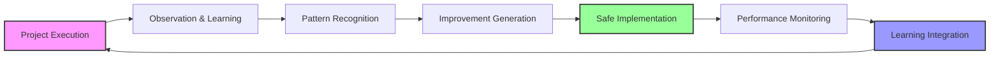

# Control Agent - Improvement Agent Integration Protocol

## Overview
This document defines the two-layer integration between Control Agent and Improvement Agent:
- **Project Layer**: Auto-activated with first user prompt, observes continuously
- **Meta Layer**: Control Agent activated after project completion for deep analysis

## Activation Workflow

```mermaid
flowchart TD
    subgraph "Project Layer - Continuous"
        A1[User First Prompt] --> A2[Auto-Activate Project Layer]
        A2 --> A3[Observe All Activities]
        A3 --> A4[Write to Global Ledger]
        A4 --> A3
    end
    
    subgraph "Meta Layer - Post-Project"
        B[Project Tasks Complete] --> C[Control Agent Final Review]
        C --> D{Project Success?}
        D -->|No| E[Project Post-Mortem]
        D -->|Yes| F[Gather Project Metrics]
        F --> G[Calculate Project Score]
        G --> H{Score > Threshold?}
        H -->|No| I[Archive Project Data]
        H -->|Yes| J[Activate Meta Layer]
        J --> K[Read Global Ledger]
        K --> L[Deep Analysis (Opus)]
        L --> M[Generate Improvement Plan]
        M --> N[Control Agent Review]
        N --> O{Confidence >99%?}
        O -->|No| P[Request Revisions]
        P --> M
        O -->|Yes| Q[Present to User]
        Q --> R{User Approval?}
        R -->|No| S[Archive Recommendations]
        R -->|Yes| T[Execute Safe Update Protocol]
        T --> U[Monitor Implementation]
        U --> V[Project Complete]
    end
    
    A3 -.->|Continuous Updates| GL[Global Ledger]
    GL -.->|Historical Data| K
    
    style A1 fill:#e3f2fd
    style J fill:#fff3e0
    style GL fill:#e8f5e9
```

## Control Agent Responsibilities

### 1. Project Completion Detection
```typescript
interface ProjectCompletionCriteria {
  allTasksComplete: boolean;
  qualityGatesPasssed: boolean;
  documentationComplete: boolean;
  testsPasssing: boolean;
  deploymentSuccessful: boolean;
  
  calculateCompletionScore(): number {
    const weights = {
      tasks: 0.3,
      quality: 0.25,
      documentation: 0.15,
      tests: 0.2,
      deployment: 0.1
    };
    
    return Object.entries(weights).reduce((score, [key, weight]) => {
      return score + (this[key] ? weight : 0);
    }, 0);
  }
}
```

### 2. Improvement Agent Activation Decision
```markdown
## Activation Criteria

### Mandatory Conditions
- [ ] All project tasks marked complete
- [ ] No critical errors or failures
- [ ] Minimum observation data collected (>100 events)
- [ ] System in stable state

### Quality Thresholds
- **Project Success Score**: >80%
- **Data Quality Score**: >90%
- **Observation Coverage**: >95%
- **System Stability**: No critical issues for 24 hours

### Activation Command
```json
{
  "command": "ACTIVATE_IMPROVEMENT_AGENT",
  "projectId": "project-uuid",
  "completionScore": 0.92,
  "observationStats": {
    "totalEvents": 1543,
    "coverage": 0.97,
    "dataQuality": 0.95
  },
  "analysisScope": "comprehensive",
  "reportingLevel": "detailed"
}
```
```

### 3. Review and Approval Process
```markdown
## Control Agent Review Protocol

### Phase 1: Initial Review
1. **Validate Analysis Completeness**
   - All agents covered
   - All workflows analyzed
   - Sufficient data points
   - Statistical significance

2. **Assess Recommendation Quality**
   - Clear problem identification
   - Evidence-based solutions
   - Realistic implementation plans
   - Appropriate risk assessment

3. **Verify Safety Measures**
   - Rollback procedures defined
   - Test plans comprehensive
   - Dependencies identified
   - Impact analysis complete

### Phase 2: Confidence Calculation
```typescript
interface ConfidenceFactors {
  analysisQuality: number;      // 0-1
  recommendationClarity: number; // 0-1
  implementationSafety: number;  // 0-1
  expectedBenefit: number;       // 0-1
  riskMitigation: number;        // 0-1
  
  calculateConfidence(): number {
    const weights = {
      analysisQuality: 0.25,
      recommendationClarity: 0.20,
      implementationSafety: 0.30,
      expectedBenefit: 0.15,
      riskMitigation: 0.10
    };
    
    const weightedSum = Object.entries(weights)
      .reduce((sum, [factor, weight]) => {
        return sum + (this[factor] * weight);
      }, 0);
    
    return Math.round(weightedSum * 100);
  }
}
```

### Phase 3: User Presentation Preparation
- Simplify technical details
- Highlight key benefits
- Clarify risks and mitigations
- Provide clear action options
```

## Integration Points

### 1. Observation Start Signal
```typescript
// Control Agent signals project start
interface ProjectStartSignal {
  type: "PROJECT_START";
  projectId: string;
  projectType: string;
  expectedDuration: string;
  participatingAgents: string[];
  observationRequirements: {
    captureLevel: "comprehensive" | "standard" | "minimal";
    focusAreas: string[];
    specialMetrics: string[];
  };
}
```

### 2. Continuous Status Updates
```typescript
// Regular observation status checks
interface ObservationStatus {
  type: "OBSERVATION_STATUS";
  projectId: string;
  eventsCaptures: number;
  storageUsed: string;
  coveragePercentage: number;
  anomaliesDetected: number;
  estimatedCompleteness: number;
}
```

### 3. Analysis Request
```typescript
// Control Agent requests analysis
interface AnalysisRequest {
  type: "ANALYZE_PROJECT";
  projectId: string;
  urgency: "immediate" | "standard" | "low";
  focusAreas?: string[];
  excludeAreas?: string[];
  reportFormat: "executive" | "detailed" | "technical";
  includeHistoricalComparison: boolean;
}
```

### 4. Improvement Plan Review
```typescript
// Improvement Agent submits plan
interface ImprovementPlan {
  type: "IMPROVEMENT_PLAN";
  projectId: string;
  analysisDate: string;
  totalRecommendations: number;
  recommendations: Recommendation[];
  expectedImpact: ImpactAssessment;
  implementationPlan: ImplementationStrategy;
  riskAssessment: RiskAnalysis;
  confidenceLevel: number;
}
```

## Quality Gates

### Pre-Activation Validation
```markdown
## Control Agent Checklist

### System State Verification
- [ ] No active tasks in any agent ledger
- [ ] All quality gates passed
- [ ] System resources available
- [ ] No pending critical updates

### Data Quality Verification
- [ ] Observation logs complete
- [ ] No significant gaps detected
- [ ] Data integrity verified
- [ ] Sufficient variety for analysis

### Timing Verification
- [ ] Appropriate time since last analysis
- [ ] No conflicting maintenance windows
- [ ] User availability for approval
- [ ] Implementation window available
```

### Post-Analysis Validation
```markdown
## Recommendation Quality Gates

### Completeness Check
- [ ] All agents analyzed
- [ ] All workflows covered
- [ ] All patterns evaluated
- [ ] All risks assessed

### Quality Check
- [ ] Recommendations specific and actionable
- [ ] Benefits quantified
- [ ] Implementation steps clear
- [ ] Success metrics defined

### Safety Check
- [ ] No breaking changes
- [ ] Rollback procedures tested
- [ ] Dependencies validated
- [ ] User impact assessed
```

## Communication Protocol

### Status Messages
```json
{
  "messages": {
    "activation": {
      "template": "Activating Improvement Agent for post-project analysis of {projectId}",
      "level": "info"
    },
    "analysisComplete": {
      "template": "Analysis complete: {recommendationCount} improvements identified",
      "level": "info"
    },
    "reviewRequired": {
      "template": "Improvement plan ready for review. Confidence: {confidence}%",
      "level": "action"
    },
    "userApprovalNeeded": {
      "template": "User approval required for {changeCount} agent improvements",
      "level": "action"
    },
    "implementationStarted": {
      "template": "Beginning safe implementation of approved improvements",
      "level": "info"
    },
    "rollbackInitiated": {
      "template": "Issue detected. Initiating rollback of improvements",
      "level": "warning"
    }
  }
}
```

### Error Handling
```typescript
interface ErrorHandling {
  activationFailure: {
    retry: boolean;
    maxRetries: 3;
    backoffStrategy: "exponential";
    fallbackAction: "log_and_notify";
  };
  analysisFailure: {
    preservePartialResults: true;
    notifyUser: true;
    diagnosticMode: true;
  };
  implementationFailure: {
    immediateRollback: true;
    preserveSystemState: true;
    incidentReport: true;
  };
}
```

## Success Metrics

### Integration Effectiveness
- **Activation Success Rate**: >95%
- **Analysis Completion Rate**: >90%
- **Recommendation Approval Rate**: >70%
- **Implementation Success Rate**: >95%

### Value Delivery
- **Average Efficiency Gain**: >20%
- **Quality Improvement**: >15%
- **Error Reduction**: >30%
- **Time Savings**: >25%

### System Stability
- **Zero Breaking Changes**: 100%
- **Successful Rollbacks**: 100%
- **User Satisfaction**: >90%
- **Agent Effectiveness**: Continuous improvement

## Continuous Improvement Loop



The Improvement Agent continuously learns from each project, making the entire agent ecosystem more efficient and effective over time, while the Control Agent ensures all changes are safe, tested, and approved before implementation.