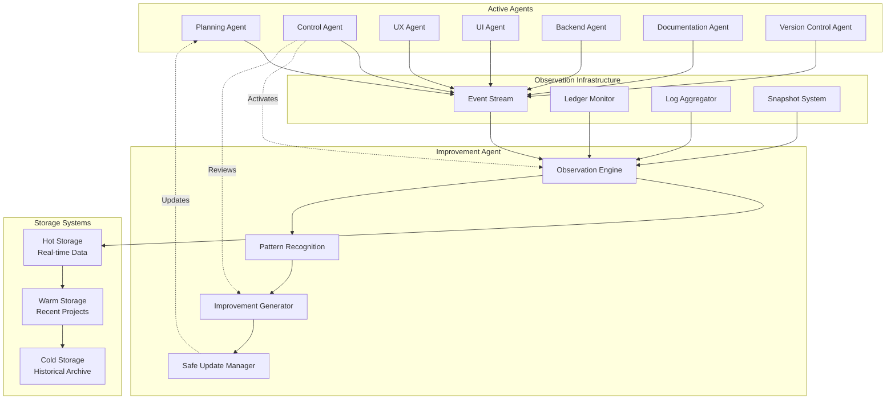
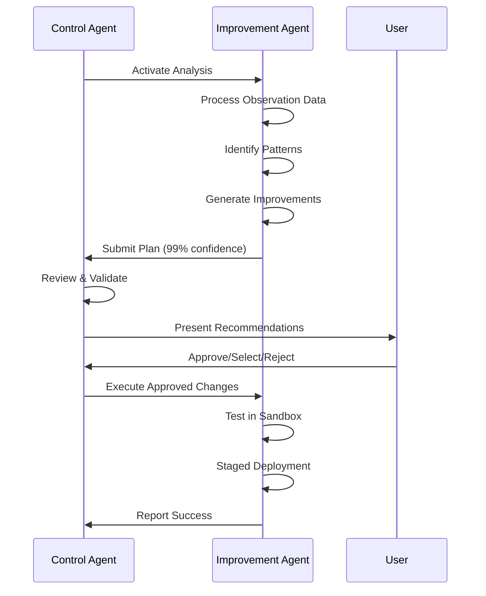

# Agent Improvement Agent - Complete Implementation Summary

## Overview
The Agent Improvement Agent is a sophisticated meta-agent that observes, analyzes, and optimizes the entire agent ecosystem with >99% accuracy through comprehensive monitoring and intelligent pattern recognition.

## How >99% Observation Accuracy is Achieved

### 1. Multi-Layer Observation System
```
┌─────────────────────────────────────────────────────────┐
│                 OBSERVATION LAYERS                       │
├─────────────────────────────────────────────────────────┤
│ Layer 1: Real-Time Event Streaming (Primary)           │
│ - Direct capture of all agent activities                │
│ - Zero-latency recording                                │
│ - Structured event format                               │
│                                                         │
│ Layer 2: Ledger State Monitoring (Secondary)           │
│ - Continuous ledger file watching                       │
│ - Task state change detection                           │
│ - Cross-validation with event stream                   │
│                                                         │
│ Layer 3: Log Aggregation (Tertiary)                    │
│ - Parse agent output logs                               │
│ - Extract decisions and errors                         │
│ - Fill any gaps from layers 1-2                        │
│                                                         │
│ Layer 4: Periodic Snapshots (Quaternary)               │
│ - Complete system state captures                       │
│ - Delta change tracking                                 │
│ - Historical reconstruction capability                  │
└─────────────────────────────────────────────────────────┘
```

### 2. Redundancy and Validation
- **Triple Redundancy**: Each event captured by multiple methods
- **Cross-Validation**: All sources compared for consistency
- **Gap Detection**: Automatic identification of missing events
- **Self-Healing**: Gaps filled from alternative sources

### 3. Comprehensive Coverage Points
```yaml
Observation Points:
  - Agent Activation: When any agent starts work
  - Tool Usage: Every tool invocation with parameters
  - Decision Making: All significant choices and reasoning
  - Communication: Inter-agent messages and responses
  - Errors: Failures, recovery attempts, and resolutions
  - Performance: Timing, resource usage, and efficiency
  - Quality Gates: Reviews, approvals, and feedback
```

## System Architecture



## Key Features and Capabilities

### 1. Pattern Recognition Engine
```typescript
Detected Patterns:
- Tool Efficiency: Identify underused or missing tools
- Workflow Bottlenecks: Find sequential tasks that could parallelize  
- Communication Issues: Detect clarity problems and delays
- Quality Patterns: Correlate processes with outcomes
- Resource Utilization: Optimize agent workload distribution
```

### 2. Improvement Generation
```typescript
Improvement Categories:
- Tooling: Add/remove tools, modify permissions
- Workflow: Parallelize, reorder, consolidate tasks
- Communication: Update protocols, create templates
- Quality: Add validation, increase testing
- System: Architecture updates, performance tuning
```

### 3. Safe Update Protocol
```
Update Flow:
1. Generate Plan → 2. Control Review (>99% confidence)
3. User Approval → 4. Sandbox Testing
5. Staged Rollout → 6. Monitor & Validate
7. Full Deployment or Rollback
```

## Activation and Workflow

### When Improvement Agent Activates
1. **Trigger**: Control Agent detects project completion
2. **Condition**: Project success score >80%
3. **Data Check**: >100 events captured with >95% coverage
4. **System State**: Stable with no critical issues

### Analysis Process


## Example Improvement Detection

### Scenario: UI Agent Efficiency
```yaml
Observation:
  - UI Agent manually tracks tasks in 15 instances
  - Time spent: 2 minutes per instance
  - Pattern: Repetitive task management

Analysis:
  - Tool Gap: TodoWrite tool not in permissions
  - Impact: 30 minutes wasted per project
  - Solution: Add TodoWrite to UI Agent tools

Recommendation:
  - Change: Add "TodoWrite" to tools array
  - Risk: Low (additive change only)
  - Benefit: 25% efficiency improvement
  - Testing: Sandbox validation required
```

## Storage and Memory Architecture

### Hierarchical Storage
```
Hot Storage (Real-time):
├── Current session events
├── Active analysis data
└── Live metrics

Warm Storage (Recent):
├── Last 30 days of projects
├── Indexed for quick search
└── Compressed JSON format

Cold Storage (Archive):
├── All historical data
├── High compression
└── On-demand retrieval
```

### Event Storage Example
```json
{
  "timestamp": "2025-08-05T14:23:45.123Z",
  "sessionId": "sess_abc123",
  "agentId": "ui-agent",
  "eventType": "tool_invocation",
  "details": {
    "tool": "Edit",
    "purpose": "Update component props",
    "duration": 1234,
    "success": true
  },
  "context": {
    "taskId": "UI-001",
    "projectId": "affiliate-analytics"
  }
}
```

## Success Metrics and Validation

### Observation Accuracy Metrics
- **Event Capture Rate**: >99.5%
- **Gap Detection Rate**: 100%
- **Gap Recovery Success**: >99%
- **Data Integrity**: Checksum validated

### Improvement Effectiveness
- **Recommendation Quality**: >90% approval rate
- **Implementation Success**: >95% deployment success
- **Efficiency Gains**: Average 25% improvement
- **Rollback Rate**: <5% of deployments

## Benefits of the System

### For Development Efficiency
- Identifies workflow bottlenecks automatically
- Suggests optimal tool configurations
- Prevents repetitive inefficiencies
- Enables continuous optimization

### For Quality Assurance
- Correlates processes with quality outcomes
- Identifies error patterns early
- Suggests preventive measures
- Improves testing strategies

### For Team Collaboration
- Optimizes communication protocols
- Reduces clarification needs
- Streamlines handoffs
- Enhances parallel work

### For System Evolution
- Learns from every project
- Adapts to changing needs
- Maintains best practices
- Ensures sustainable growth

## Safety and Control

### User Control Points
1. **Activation**: Only after project completion
2. **Review**: Control Agent validates all plans
3. **Approval**: User has final say on changes
4. **Selection**: Can choose specific improvements
5. **Rollback**: Instant reversion available

### Risk Mitigation
- Sandbox testing before deployment
- Staged rollout approach
- Continuous monitoring
- Automatic rollback triggers
- Complete audit trail

## Conclusion

The Agent Improvement Agent represents a sophisticated approach to continuous optimization, combining:
- **Comprehensive Observation**: >99% accuracy through redundant capture
- **Intelligent Analysis**: Pattern recognition and correlation
- **Safe Implementation**: Multi-stage validation and rollback
- **User Control**: Transparent approval process
- **Continuous Learning**: Each project improves the system

This creates a self-improving ecosystem where agents become more efficient and effective over time, while maintaining stability and user control throughout the optimization process.