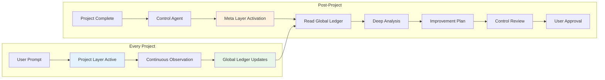

# Improvement Agent Two-Layer System - Complete Implementation

## System Overview

The Improvement Agent now operates as a sophisticated two-layer system designed for continuous learning and optimization across all projects:

```
┌─────────────────────────────────────────────────────────────┐
│                    IMPROVEMENT AGENT                         │
├─────────────────────────────────────────────────────────────┤
│  Layer 1: PROJECT LAYER (Claude Sonnet 4)                  │
│  - Activated: First user prompt                             │
│  - Duration: Entire project                                 │
│  - Actions: Observe, Record, Aggregate                      │
│  - Output: Global Observation Ledger                        │
│                                                             │
│  Layer 2: META LAYER (Claude Opus 4)                       │
│  - Activated: Control Agent signal post-project            │
│  - Duration: Analysis phase only                            │
│  - Actions: Analyze, Synthesize, Recommend                 │
│  - Output: Comprehensive improvement plans                  │
└─────────────────────────────────────────────────────────────┘
```

## Key Innovation: Global Observation Ledger

### Location
```bash
~/.claude/global-observation/observation-ledger.json
```

### Purpose
- **Cross-Project Learning**: Accumulate insights from all projects
- **Pattern Emergence**: Identify trends across multiple implementations
- **Historical Context**: Learn from past successes and failures
- **Continuous Evolution**: Each project improves the system

## Layer 1: Project Layer (Continuous Observation)

### Activation
- **Automatic**: Starts with first user prompt
- **Model**: Claude 3.5 Sonnet (efficient, real-time)
- **Mode**: Silent, non-intrusive observation
- **Duration**: Entire project lifecycle

### What It Observes
```yaml
Observation Categories:
  1. Efficiency:
     - Task completion times
     - Tool usage patterns
     - Workflow bottlenecks
     - Resource utilization
     
  2. Error Patterns:
     - Common failures
     - Recovery strategies
     - Time to resolution
     - Root causes
     
  3. Synchronization:
     - Agent communication
     - Handoff efficiency
     - Dependency management
     - Collaboration quality
     
  4. Code Quality:
     - Complexity metrics
     - Clarity indicators
     - Simplification opportunities
     - Architecture decisions
     
  5. Testing:
     - First-pass success rates
     - Coverage maintenance
     - Iteration patterns
     - Failure reasons
     
  6. Version Control:
     - Commit quality
     - Branch management
     - Merge conflicts
     - Message clarity
     
  7. Best Practices:
     - Framework usage
     - Modern patterns
     - Deprecated methods
     - Standard compliance
     
  8. Control Efficiency:
     - Review cycles
     - Approval rates
     - Confidence levels
     - Escalation patterns
```

### Key Restrictions
- **No Improvements**: Cannot suggest changes during project
- **No Interventions**: Cannot interrupt or guide agents
- **Observation Only**: Pure data collection and recording

## Layer 2: Meta Layer (Deep Analysis)

### Activation
- **Trigger**: Control Agent signal after project completion
- **Model**: Claude 3.5 Opus (deep thinking, complex analysis)
- **Input**: Entire global observation ledger
- **Output**: Comprehensive improvement recommendations

### Analysis Focus Areas
```yaml
Improvement Goals:
  1. "More Efficient":
     - Reduce task completion times
     - Minimize resource usage
     - Eliminate redundant work
     
  2. "Less Errors":
     - Prevent common failures
     - Improve error recovery
     - Reduce debugging time
     
  3. "Better Synchronization":
     - Perfect agent coordination
     - Seamless handoffs
     - Clear communication
     
  4. "Cleaner Code":
     - Simpler implementations
     - Better readability
     - Reduced complexity
     
  5. "Better Architecture":
     - Scalable designs
     - Maintainable patterns
     - Robust structures
     
  6. "Testing Excellence":
     - Higher first-pass rates
     - Maintained coverage
     - Fewer iterations
     
  7. "Modern Practices":
     - Latest frameworks
     - Current patterns
     - Best practices
     
  8. "Control Optimization":
     - Fewer review cycles
     - Higher confidence
     - Faster approvals
```

## Data Flow



## Benefits of Two-Layer Architecture

### 1. Continuous Learning
- Every project contributes to knowledge base
- Patterns emerge across implementations
- Historical context informs improvements
- System evolves with each project

### 2. Non-Disruptive
- No interference with active projects
- Zero performance impact
- Silent observation
- Unbiased data collection

### 3. Deep Analysis Quality
- Dedicated Opus model for complex thinking
- Cross-project pattern recognition
- Statistical significance validation
- Evidence-based recommendations

### 4. Comprehensive Optimization
- All aspects of development covered
- Multi-dimensional improvements
- Holistic system enhancement
- Measurable success criteria

## Example Observation Entry

```json
{
  "timestamp": "2025-08-05T14:30:00Z",
  "projectId": "vvk_zahlen_analyzer",
  "layer": "project",
  "observation": {
    "category": "efficiency",
    "agent": "ui-agent",
    "pattern": "manual_task_tracking",
    "details": {
      "occurrences": 15,
      "timeWasted": 1800,
      "suggestedImprovement": "Add TodoWrite tool",
      "confidenceScore": 0.95
    }
  }
}
```

## Example Meta Layer Output

```yaml
Improvement Recommendation:
  id: "IMP-2025-001"
  title: "UI Agent Tool Enhancement"
  
  observation_basis:
    - "15 instances of manual task tracking across 3 projects"
    - "Average 2 minutes wasted per instance"
    - "Pattern confidence: 95%"
    
  recommendation:
    - Add "TodoWrite" to UI Agent tools array
    - Expected efficiency gain: 25%
    - Risk level: Low (additive change only)
    
  implementation:
    - Update: docs/agents/ui-agent.md
    - Modify: tools array in YAML frontmatter
    - Testing: Sandbox validation required
    
  success_metrics:
    - Task tracking time reduction >80%
    - No negative side effects
    - Agent satisfaction improvement
```

## Global Ledger Benefits

### Cross-Project Intelligence
- Learn from all projects, not just current one
- Identify universal patterns vs. project-specific issues
- Build comprehensive improvement knowledge base
- Enable predictive optimization

### Historical Learning
- Track improvement success rates
- Learn from failed optimizations
- Build confidence in recommendations
- Refine pattern recognition

### Continuous Evolution
- Each project makes system smarter
- Improvements compound over time
- Adaptation to changing practices
- Future-proof optimization

## Success Metrics

### Project Layer
- **Observation Coverage**: >99% of activities captured
- **Ledger Update Frequency**: Regular, consistent
- **Pattern Detection**: Significant patterns identified
- **Performance Impact**: <1% overhead

### Meta Layer
- **Analysis Depth**: Comprehensive cross-project review
- **Recommendation Quality**: >90% approval rate
- **Implementation Success**: >95% positive impact
- **System Evolution**: Continuous improvement trend

## Summary

The two-layer Improvement Agent represents a paradigm shift in continuous optimization:

1. **Project Layer** silently observes every project from start to finish
2. **Global Ledger** accumulates wisdom across all projects
3. **Meta Layer** performs deep analysis for meaningful improvements
4. **Control Agent** ensures safety and quality
5. **User** maintains final approval authority

This creates a self-improving ecosystem where:
- Every project contributes to collective knowledge
- Patterns emerge from real-world usage
- Improvements are evidence-based and tested
- The system becomes more intelligent over time
- All agents work more efficiently with each iteration

The result is a development environment that continuously evolves to be more efficient, produce fewer errors, and deliver higher quality outcomes with less effort.