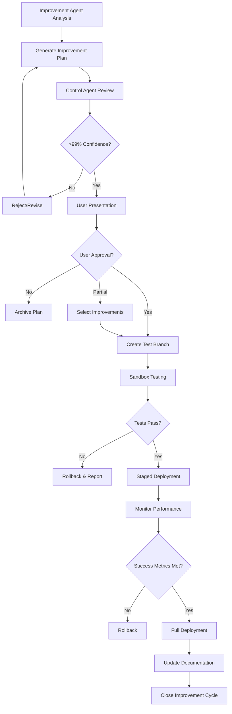

# Safe Agent Update Protocol

## Overview
This protocol ensures all agent improvements are safely tested, reviewed, and approved before implementation, maintaining system stability while enabling continuous optimization.

## Update Workflow



## Detailed Protocol Steps

### Phase 1: Improvement Plan Generation
```markdown
## Improvement Plan Structure

### 1. Executive Summary
- **Improvement Count**: Total number of proposed changes
- **Impact Assessment**: Expected efficiency/quality gains
- **Risk Level**: Low/Medium/High with justification
- **Implementation Timeline**: Phased rollout schedule

### 2. Detailed Improvements
For each improvement:
- **ID**: Unique identifier (e.g., IMP-2025-001)
- **Type**: Tool/Workflow/Communication/Quality/System
- **Target**: Specific agent(s) affected
- **Current State**: Description with metrics
- **Proposed State**: Specific changes with rationale
- **Expected Impact**: Quantified benefits
- **Implementation Steps**: Detailed procedure
- **Rollback Plan**: How to revert if needed
- **Success Metrics**: How to measure success

### 3. Risk Analysis
- **Dependencies**: Other systems/agents affected
- **Potential Failures**: What could go wrong
- **Mitigation Strategies**: How to prevent/handle failures
- **Blast Radius**: Worst-case impact assessment

### 4. Test Plan
- **Unit Tests**: Component-level validation
- **Integration Tests**: Multi-agent interaction tests
- **Performance Tests**: Ensure no degradation
- **User Acceptance**: Validation criteria
```

### Phase 2: Control Agent Review
```markdown
## Control Agent Validation Checklist

### Architecture Compliance
- [ ] Changes align with system architecture
- [ ] No breaking changes to interfaces
- [ ] Maintains separation of concerns
- [ ] Preserves system modularity

### Security Review
- [ ] No new security vulnerabilities
- [ ] Maintains data access controls
- [ ] Preserves authentication flows
- [ ] Complies with privacy requirements

### Quality Standards
- [ ] Testing requirements defined
- [ ] Documentation plan included
- [ ] Performance benchmarks set
- [ ] Rollback procedures clear

### Risk Assessment
- [ ] Risk level appropriate
- [ ] Mitigation strategies adequate
- [ ] Dependencies correctly identified
- [ ] Timeline realistic

### Confidence Calculation
```typescript
confidence = (
  architecture_score * 0.3 +
  security_score * 0.3 +
  quality_score * 0.2 +
  risk_score * 0.2
) * completeness_factor
```

**Approval Threshold**: >99% confidence required
```

### Phase 3: User Presentation & Approval
```markdown
## User-Friendly Presentation Format

### Summary Dashboard
```
┌─────────────────────────────────────────────────┐
│        AGENT IMPROVEMENT RECOMMENDATIONS         │
├─────────────────────────────────────────────────┤
│ Total Improvements: 12                          │
│ Expected Efficiency Gain: 35%                   │
│ Risk Level: Low-Medium                          │
│ Implementation Time: 3 days                     │
└─────────────────────────────────────────────────┘

TOP RECOMMENDATIONS:
1. ✨ Add TodoWrite tool to UI Agent
   Impact: 25% faster task tracking
   Risk: Low
   
2. 🚀 Parallelize UX and Backend work
   Impact: 1.5 day timeline reduction
   Risk: Medium
   
3. 📝 Standardize communication templates
   Impact: 50% fewer clarifications
   Risk: Low
```

### Detailed View (On Request)
- Technical implementation details
- Full risk assessment
- Alternative approaches considered
- Historical performance data

### Approval Options
```
[APPROVE ALL] - Implement all recommendations
[SELECT ITEMS] - Choose specific improvements
[DEFER] - Postpone for later review
[REJECT] - Decline with feedback
```
```

### Phase 4: Sandbox Testing
```markdown
## Isolated Testing Environment

### 1. Test Branch Creation
```bash
# Create isolated test branch
git checkout -b agent-improvements/IMP-2025-001-012

# Copy current agent configurations
cp -r docs/agents /tmp/agents-backup

# Apply improvements to test branch
./apply-improvements.sh --test-mode
```

### 2. Sandbox Validation
```typescript
interface SandboxTest {
  testId: string;
  testType: 'unit' | 'integration' | 'performance' | 'regression';
  targetAgent: string;
  testScenario: string;
  expectedResult: any;
  actualResult: any;
  status: 'pass' | 'fail' | 'skip';
  executionTime: number;
}
```

### 3. Test Scenarios
- **Isolated Agent Tests**: Single agent functionality
- **Integration Tests**: Multi-agent workflows
- **Regression Tests**: Ensure no breaking changes
- **Performance Tests**: Validate no degradation
- **Edge Case Tests**: Unusual scenarios

### 4. Success Criteria
- All tests pass (100%)
- Performance within 5% of baseline
- No new errors introduced
- All success metrics achievable
```

### Phase 5: Staged Deployment
```markdown
## Progressive Rollout Strategy

### Stage 1: Single Agent Pilot (Day 1)
- Deploy to least critical agent first
- Monitor for 24 hours
- Collect performance metrics
- Gather agent feedback

### Stage 2: Agent Group Deployment (Day 2-3)
- Deploy to related agent group
- Test inter-agent interactions
- Validate workflow improvements
- Monitor system stability

### Stage 3: System-Wide Deployment (Day 4)
- Deploy to all remaining agents
- Full system validation
- Performance benchmarking
- User acceptance testing

### Stage 4: Production Activation (Day 5)
- Activate all improvements
- Monitor continuously
- Document lessons learned
- Close improvement cycle

### Rollback Triggers
- Performance degradation >10%
- Error rate increase >5%
- Agent conflicts detected
- User-reported issues
- Confidence level drop
```

### Phase 6: Monitoring & Validation
```markdown
## Continuous Monitoring Protocol

### Real-Time Metrics
```typescript
interface MonitoringDashboard {
  deploymentStatus: 'active' | 'monitoring' | 'rolled_back';
  metrics: {
    efficiency: {
      baseline: number;
      current: number;
      improvement: number;
    };
    quality: {
      errorRate: number;
      testCoverage: number;
      firstPassSuccess: number;
    };
    performance: {
      responseTime: number;
      throughput: number;
      resourceUsage: number;
    };
  };
  alerts: Alert[];
  agentHealth: Record<string, HealthStatus>;
}
```

### Alert Thresholds
- **Warning**: 5% degradation in any metric
- **Critical**: 10% degradation or system errors
- **Emergency**: System instability or data issues

### Success Validation
- Expected improvements achieved
- No unexpected side effects
- Agent satisfaction maintained
- System stability confirmed
```

## Rollback Procedures

### Immediate Rollback
```bash
# Instant reversion to previous state
./rollback-improvements.sh --immediate

# Restore agent configurations
cp -r /tmp/agents-backup/* docs/agents/

# Clear improvement flags
./clear-improvement-state.sh
```

### Graduated Rollback
```markdown
## Selective Rollback Process

1. **Identify Problem Source**
   - Which improvement caused issues?
   - Is it isolated or systemic?
   - Can it be fixed in place?

2. **Selective Reversion**
   - Rollback only affected improvements
   - Maintain successful changes
   - Document failure reasons

3. **Analysis & Learning**
   - Why did the improvement fail?
   - How to prevent similar issues?
   - Update detection algorithms
```

## Documentation Requirements

### Pre-Implementation
```markdown
## Required Documentation

1. **Improvement Rationale**
   - Why this improvement?
   - Expected benefits
   - Implementation approach

2. **Technical Specification**
   - Exact changes to be made
   - Configuration updates
   - Code modifications

3. **Test Documentation**
   - Test scenarios
   - Expected results
   - Success criteria
```

### Post-Implementation
```markdown
## Completion Documentation

1. **Implementation Report**
   - What was changed
   - Deployment timeline
   - Issues encountered

2. **Performance Report**
   - Metrics before/after
   - Improvement validation
   - Lessons learned

3. **Agent Feedback**
   - User experience changes
   - Effectiveness assessment
   - Suggested refinements
```

## Emergency Procedures

### System-Wide Issues
```markdown
## Emergency Response Protocol

### 1. Immediate Actions
- [ ] Activate emergency rollback
- [ ] Notify all stakeholders
- [ ] Preserve system state for analysis
- [ ] Initiate incident response

### 2. Communication Plan
- Control Agent: Coordinate response
- Planning Agent: Assess impact
- All Agents: Report status
- Users: Transparent updates

### 3. Recovery Steps
1. Stabilize system
2. Identify root cause
3. Implement fix
4. Gradual restoration
5. Post-mortem analysis

### 4. Prevention Measures
- Enhanced testing requirements
- Stricter approval criteria
- Improved monitoring
- Updated risk assessment
```

## Success Metrics

### Improvement Effectiveness
- **Efficiency Gains**: Measured time savings
- **Quality Improvement**: Error rate reduction
- **Agent Satisfaction**: Ease of use scores
- **ROI Achievement**: Benefit vs. cost

### Process Effectiveness
- **Deployment Success Rate**: >95%
- **Rollback Frequency**: <5%
- **Time to Value**: <1 week
- **User Satisfaction**: >90%

### Continuous Learning
- **Pattern Recognition Accuracy**: Improving over time
- **Recommendation Quality**: Higher success rate
- **Risk Prediction**: Better assessment
- **Process Optimization**: Faster deployments