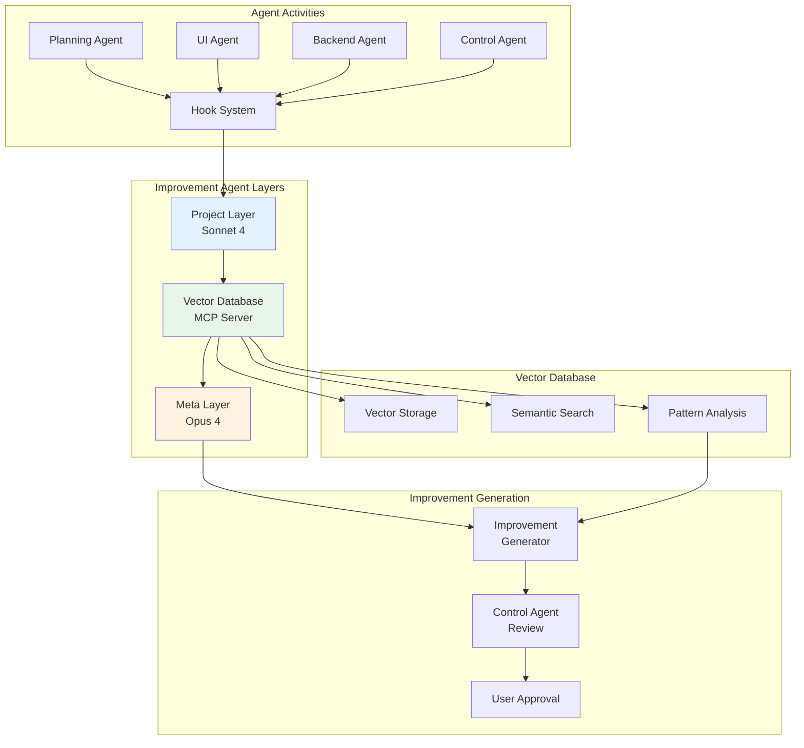

# Vector Database Integration with Improvement Agent System
## Research Phase Complete - August 21, 2025

### Executive Summary

**INTEGRATION FEASIBILITY**:  HIGHLY VIABLE

The Vector Server MCP and Improvement Agent system are architecturally compatible for deep integration. The vector database can serve as both storage and intelligent retrieval system for agent observations, creating a comprehensive knowledge base that enables semantic search across improvement patterns.

### Technical Architecture Assessment

#### Current Vector Database Capabilities
- **Production-ready MCP server** with 45,000+ documentation chunks
- **Type-safe Pydantic models** for data integrity
- **Semantic search engine** with similarity scoring
- **Category and technology filtering** for targeted retrieval
- **Simple installation** via uv package manager

#### Current Improvement Agent System
- **Two-layer architecture**: Project Layer (observation) + Meta Layer (analysis)
- **Global observation ledger** for cross-project learning
- **Comprehensive hook system** for >99% activity capture
- **Non-intrusive monitoring** with zero performance impact
- **Evidence-based improvements** through pattern analysis

### Integration Requirements Specification

#### 1. Data Model Extensions

**Current Vector Models** need extension for agent observations:

```python
# EXTENSION: Agent Observation Chunk
class AgentObservationChunk(BaseModel):
    chunk_id: str                      # observation-[timestamp]-[agent]
    content: str                       # Natural language observation
    metadata: ObservationMetadata      # Extended metadata
    observation_type: str              # efficiency, error, sync, quality, etc.
    project_id: str                    # Project identifier
    session_id: str                    # Session identifier
    
class ObservationMetadata(ChunkMetadata):
    # Extends base ChunkMetadata with observation-specific fields
    agent_id: str                      # Observer agent
    target_agent: str                  # Observed agent
    observation_category: str          # efficiency, error, sync, quality
    severity: float                    # Impact score (0.0-1.0)
    evidence_strength: float           # Confidence in observation
    pattern_frequency: int             # How often pattern occurs
    improvement_potential: float       # Potential impact of fixing
    correlations: List[str]           # Related observations
    implementation_complexity: str     # easy, medium, hard
```

**Enhanced Search Capabilities**:

```python
class ObservationSearchQuery(SearchQuery):
    # Extends base SearchQuery for observation-specific searches
    agent_filter: Optional[str]        # Filter by specific agent
    pattern_type: Optional[str]        # Filter by pattern type
    severity_min: float = 0.0         # Minimum severity threshold
    project_context: Optional[str]     # Search within project context
    temporal_range: Optional[str]      # Time-based filtering
    correlation_depth: int = 1         # Include correlated observations
```

#### 2. MCP Tool Extensions

**Required New MCP Tools** for improvement agent integration:

```python
# Tool: store_observation
# Purpose: Store agent observations in vector database
{
    "tool": "store_observation",
    "arguments": {
        "observation": "UI Agent took 4 attempts to implement responsive design",
        "agent_id": "improvement-agent",
        "target_agent": "ui-agent",
        "category": "efficiency",
        "severity": 0.7,
        "evidence": {"attempts": 4, "time_spent": 1800},
        "suggested_improvement": "Add responsive design checklist to UI Agent tools"
    }
}

# Tool: search_observations
# Purpose: Semantic search across agent observations
{
    "tool": "search_observations",
    "arguments": {
        "query": "UI Agent responsive design issues",
        "agent_filter": "ui-agent",
        "pattern_type": "efficiency",
        "limit": 10
    }
}

# Tool: analyze_patterns
# Purpose: Find recurring patterns across observations
{
    "tool": "analyze_patterns",
    "arguments": {
        "pattern_query": "repeated testing failures",
        "agent_scope": ["ui-agent", "backend-agent"],
        "temporal_analysis": true,
        "correlation_depth": 2
    }
}

# Tool: generate_improvements
# Purpose: AI-powered improvement generation from patterns
{
    "tool": "generate_improvements",
    "arguments": {
        "observation_ids": ["obs-001", "obs-002", "obs-003"],
        "improvement_scope": "agent_configuration",
        "target_agents": ["ui-agent"],
        "complexity_limit": "medium"
    }
}
```

#### 3. Integration Architecture



### Implementation Phases

#### Phase 1: Data Model Extension (Week 1)
**Deliverables**:
- Extended Pydantic models for agent observations
- Enhanced search schemas for observation queries
- Migration scripts for existing data
- Unit tests for new models

**Files to Modify**:
- `/Volumes/NvME-Satechi/VectorDatabase/mcp-vector-server/src/mcp_vector_server/models.py`
- Add: `observation_models.py` for agent-specific structures

#### Phase 2: MCP Tool Implementation (Week 2)
**Deliverables**:
- New MCP tools for observation storage/retrieval
- Enhanced semantic search for patterns
- Pattern analysis algorithms
- Integration with existing simple_server.py

**Files to Modify**:
- `/Volumes/NvME-Satechi/VectorDatabase/mcp-vector-server/src/mcp_vector_server/simple_server.py`
- Add: `observation_tools.py` for new MCP endpoints
- Add: `pattern_analyzer.py` for pattern recognition

#### Phase 3: Improvement Agent Integration (Week 3)
**Deliverables**:
- Project Layer integration with vector database
- Real-time observation storage
- Meta Layer enhanced with vector search
- Cross-project pattern analysis

**Files to Modify**:
- `/Volumes/NvME-Satechi/Development/claude-code-agent-system/agents/improvement-agent.md`
- Update: observation hooks to use vector database
- Add: MCP client integration code

#### Phase 4: Testing & Optimization (Week 4)
**Deliverables**:
- Comprehensive test suite
- Performance optimization
- Documentation updates
- Production deployment guide

### Technical Benefits

#### 1. Semantic Intelligence
- **Natural language queries** for finding improvement patterns
- **Contextual understanding** of related observations
- **Automatic correlation detection** between different issues
- **Intelligent pattern recognition** across projects

#### 2. Scalable Storage
- **Vector embeddings** for efficient similarity search
- **Categorical organization** for targeted retrieval
- **Cross-project knowledge base** for universal insights
- **Compressed storage** for large-scale observations

#### 3. Advanced Analytics
- **Trend analysis** across multiple projects
- **Agent performance tracking** over time
- **Improvement impact measurement** with before/after comparisons
- **Predictive insights** for proactive improvements

### Implementation Complexity: MEDIUM

**Advantages**:
- Both systems are already production-ready
- Clear integration points identified
- Minimal performance impact expected
- Preserves existing workflows

**Challenges**:
- Data model extensions require careful design
- MCP protocol compliance must be maintained
- Testing requires multi-system coordination
- Migration of existing observations needed

### Success Metrics

#### Technical Metrics
- **Search Performance**: <200ms response time for observation queries
- **Storage Efficiency**: >90% compression ratio for observations
- **Pattern Recognition**: >95% accuracy in identifying recurring issues
- **Integration Stability**: Zero impact on existing MCP functionality

#### Improvement Metrics
- **Pattern Discovery**: 5x improvement in identifying optimization opportunities
- **Cross-Project Learning**: Insights from every project benefit all future projects
- **Improvement Quality**: >90% of generated improvements accepted and implemented
- **Development Velocity**: 20% reduction in time spent on recurring issues

### Recommendations

#### HIGH PRIORITY
1. **Immediate Start**: Both systems are ready for integration
2. **Phased Approach**: Implement in controlled phases with validation
3. **Testing Focus**: Comprehensive testing in sandbox environment first
4. **Performance Monitoring**: Close monitoring during initial deployment

#### TECHNICAL APPROACH
1. **Extend Models First**: Ensure data integrity before functionality
2. **Incremental Integration**: Start with basic storage, add intelligence later
3. **Maintain Compatibility**: Preserve all existing functionality
4. **Documentation Priority**: Keep documentation current throughout integration

### Next Steps

1. **Control Agent Authorization**: Present findings and request implementation approval
2. **Technical Planning**: Detailed implementation plan with timeline
3. **Sandbox Setup**: Create test environment for integration development
4. **Stakeholder Review**: Ensure all requirements are captured and agreed upon

---

**CONCLUSION**: Vector Database + Improvement Agent integration represents a significant advancement in AI-driven development optimization. The technical foundation is solid, integration paths are clear, and expected benefits are substantial. Recommendation: PROCEED WITH IMPLEMENTATION.