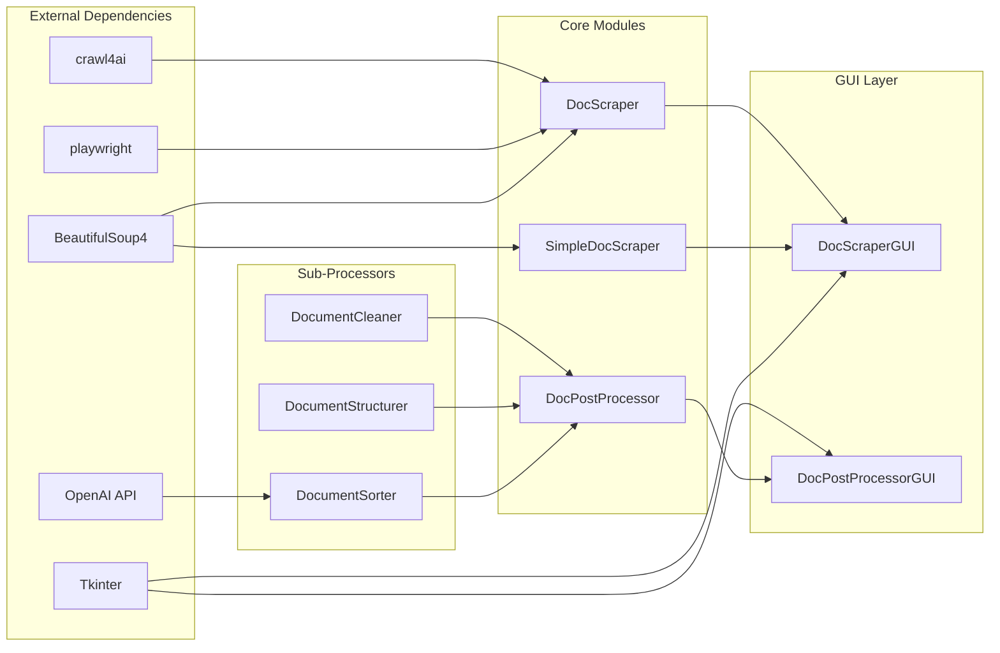

# Architecture Documentation

## System Architecture

DocScraper follows a modular, pipeline-based architecture with clear separation between data acquisition (scraping) and data processing (post-processing). The system is designed for extensibility, allowing new scrapers, processors, and output formats to be added easily.

## Core Modules

### 1. Scraping Module (`DocScraper.py`)

**Purpose**: Advanced asynchronous web scraper with parallel processing capabilities

**Key Components**:
```python
class DocumentationScraper:
    - __init__(output_dir: str)
    - crawl_documentation(start_url: str, max_pages: int)
    - _is_valid_doc_url(url: str) -> bool
    - _clean_filename(url: str) -> str
    - _extract_internal_links(html: str, base_url: str) -> List[str]
    - _save_content(url: str, markdown: str, metadata: dict)
```

**Responsibilities**:
- URL discovery and validation
- Asynchronous page fetching
- HTML to Markdown conversion
- Link extraction and crawling queue management
- Rate limiting and error handling

**Dependencies**:
- `crawl4ai`: Core crawling engine
- `BeautifulSoup4`: HTML parsing
- `asyncio`: Asynchronous operations
- `Playwright`: Browser automation

### 2. Simple Scraping Module (`SimpleDocScraper.py`)

**Purpose**: Lightweight sequential scraper for basic needs

**Key Components**:
- Synchronous crawling
- Minimal dependencies
- Simple queue-based URL management

**Use Cases**:
- Small documentation sites
- Testing and debugging
- Environments where async is problematic

### 3. Post-Processing Module (`DocPostProcessor.py`)

**Purpose**: Transform scraped documents for vector database ingestion

**Key Components**:
```python
class DocumentPostProcessor:
    - __init__(input_dir: str, output_dir: str, api_key: Optional[str])
    - process_all_documents() -> dict
    
class DocumentCleaner:
    - clean_markdown(content: str) -> str
    - remove_navigation(content: str) -> str
    - extract_metadata(content: str) -> dict
    
class DocumentStructurer:
    - create_chunks(content: str, chunk_size: int) -> List[dict]
    - add_overlap(chunks: List[dict], overlap: int) -> List[dict]
    - calculate_embeddings(chunks: List[dict]) -> List[dict]
    
class DocumentSorter:
    - categorize_documents(docs: List[dict]) -> dict
    - calculate_complexity(doc: dict) -> float
    - order_by_dependencies(docs: List[dict]) -> List[dict]
```

**Responsibilities**:
- Content cleaning and normalization
- Hierarchical chunking
- Metadata extraction
- LLM-based classification
- Dependency analysis
- Complexity scoring

### 4. GUI Modules

#### DocScraperGUI.py
**Purpose**: User-friendly interface for web scraping

**Components**:
- URL input and validation
- Progress monitoring
- Real-time logging
- Error reporting
- Configuration panel

#### DocPostProcessorGUI.py
**Purpose**: Visual interface for document processing

**Components**:
- Directory selection
- Processing options
- Progress visualization
- Results summary
- Export configuration

## Module Dependencies



## Data Flow Architecture

### Scraping Pipeline

```
1. URL Discovery
   ├── Start URL validation
   ├── Domain extraction
   └── Queue initialization

2. Page Processing
   ├── Async fetch with Playwright
   ├── JavaScript rendering
   ├── HTML extraction
   └── Error handling

3. Content Extraction
   ├── HTML to Markdown conversion
   ├── Image/asset handling
   ├── Code block preservation
   └── Link extraction

4. Storage
   ├── Filename sanitization
   ├── Metadata generation
   ├── File writing
   └── Summary updates
```

### Post-Processing Pipeline

```
1. Document Loading
   ├── Recursive directory scanning
   ├── Markdown parsing
   ├── Metadata extraction
   └── Initial validation

2. Cleaning Phase
   ├── Navigation removal
   ├── Footer/header stripping
   ├── Duplicate content detection
   └── Format normalization

3. Structuring Phase
   ├── Heading hierarchy parsing
   ├── Semantic chunking
   ├── Overlap calculation
   └── Chunk metadata

4. Sorting Phase
   ├── Document categorization
   ├── Complexity analysis
   ├── Dependency graphing
   └── Learning path optimization

5. Export Phase
   ├── Vector DB index generation
   ├── Chunk file creation
   ├── Metadata aggregation
   └── Summary statistics
```

## Extension Points

### Adding New Scrapers

1. Implement the base scraper interface:
```python
class CustomScraper:
    def __init__(self, output_dir: str)
    async def crawl(self, url: str) -> dict
    def extract_links(self, html: str) -> List[str]
    def save_content(self, content: dict)
```

2. Register in the GUI module
3. Add configuration options

### Adding New Processors

1. Implement processor interface:
```python
class CustomProcessor:
    def process(self, content: str) -> dict
    def get_metadata(self) -> dict
```

2. Add to processing pipeline
3. Update configuration schema

### Adding Output Formats

1. Implement exporter interface:
```python
class CustomExporter:
    def export(self, data: dict, output_path: str)
    def get_format_name(self) -> str
```

2. Register in export pipeline
3. Add format-specific options

## Performance Optimization

### Scraping Optimizations
- **Concurrent Fetching**: Up to 5 parallel requests
- **Memory-Adaptive Dispatcher**: Adjusts based on system resources
- **Rate Limiting**: Prevents server overload
- **Cache Management**: Avoids re-fetching unchanged pages
- **Connection Pooling**: Reuses HTTP connections

### Processing Optimizations
- **Batch Processing**: Processes documents in batches
- **Lazy Loading**: Loads documents on-demand
- **Parallel Chunking**: Multi-threaded chunk generation
- **Caching**: LRU cache for repeated operations
- **Memory Management**: Streaming for large documents

## Error Handling Strategy

### Graceful Degradation
- Continue on individual page failures
- Retry failed URLs with exponential backoff
- Fall back to simpler extraction methods
- Log errors without stopping pipeline

### Recovery Mechanisms
- Checkpoint saving during long operations
- Resume capability from last checkpoint
- Partial result saving
- Detailed error reporting

## Scalability Considerations

### Horizontal Scaling
- Distributed crawling with job queue
- Parallel processing across multiple cores
- Load balancing for large sites

### Vertical Scaling
- Memory-adaptive algorithms
- Streaming processing for large files
- Efficient data structures

## Security Architecture

### Input Validation
- URL sanitization
- Path traversal prevention
- Content type verification
- Size limits on downloads

### API Security
- Environment variable storage
- No hardcoded credentials
- Rate limiting on API calls
- Secure key rotation support

### Output Security
- Filename sanitization
- No code execution from scraped content
- XSS prevention in saved content
- Safe markdown rendering

## Monitoring and Observability

### Logging
- Structured logging with levels
- Separate logs for scraping and processing
- Error aggregation
- Performance metrics

### Progress Tracking
- Real-time progress updates
- ETA calculations
- Resource usage monitoring
- Success/failure statistics

## Future Architecture Considerations

### Planned Enhancements
1. **Plugin System**: Dynamic loading of scrapers/processors
2. **Distributed Mode**: Multi-machine crawling
3. **Real-time Processing**: Stream processing pipeline
4. **ML Integration**: Advanced content understanding
5. **API Server**: REST API for remote operation

### Technical Debt
1. **Testing Coverage**: Need more unit tests
2. **Type Hints**: Complete type annotations
3. **Configuration**: Centralized config management
4. **Monitoring**: Production-ready metrics
5. **Documentation**: API documentation generation