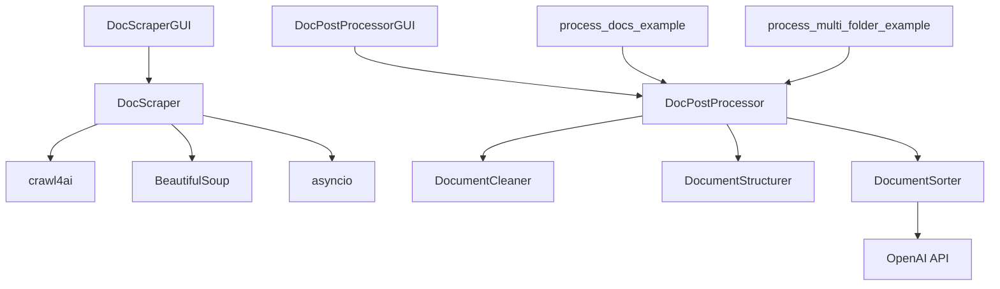

# Code Map

## Directory Structure Overview

```
DocScraper/
├── Core Modules (Root Level)
├── Documentation (docs/)
├── Test Files (tests/)
├── Output Directories
└── Configuration Files
```

## Root Level Files

### Core Scraping Modules

#### `DocScraper.py` (589 lines)
**Purpose**: Advanced asynchronous web scraper with parallel processing
- Main class: `DocumentationScraper`
- Implements concurrent crawling with `crawl4ai`
- Features rate limiting, memory-adaptive dispatching
- Handles JavaScript-rendered pages via Playwright
- Exports to markdown with metadata preservation

#### `SimpleDocScraper.py` (312 lines)
**Purpose**: Simplified sequential scraper for basic needs
- Synchronous implementation for smaller sites
- Minimal dependencies (no async required)
- Queue-based URL management
- Good for testing and debugging

#### `DocScraperGUI.py` (425 lines)
**Purpose**: Tkinter-based GUI for web scraping
- User-friendly interface with URL input
- Real-time progress tracking with progress bar
- Live logging display
- Start/stop controls
- Configuration panel for max pages and output directory

### Post-Processing Modules

#### `DocPostProcessor.py` (782 lines)
**Purpose**: Transform scraped documents for vector database ingestion
- Main class: `DocumentPostProcessor`
- Sub-classes:
  - `DocumentCleaner`: Removes navigation, headers, footers
  - `DocumentStructurer`: Creates semantic chunks with overlap
  - `DocumentSorter`: Categorizes and orders documents
- LLM integration for intelligent classification
- Outputs vector-ready JSON index

#### `DocPostProcessorGUI.py` (398 lines)
**Purpose**: Tkinter GUI for document post-processing
- Directory selection dialogs
- Processing options (LLM toggle, chunk size)
- Progress visualization
- Results summary display
- Export configuration

### Example Scripts

#### `process_docs_example.py` (145 lines)
**Purpose**: Demonstrates basic post-processing workflow
- Shows how to process Anthropic documentation
- Examples with and without LLM classification
- Custom configuration examples
- Batch processing demonstration

#### `process_multi_folder_example.py` (178 lines)  
**Purpose**: Multi-folder processing demonstration
- Recursive directory processing
- Output flattening examples
- Handling complex folder structures
- Consolidation strategies

### Test Files

#### `test_stop.py` (42 lines)
**Purpose**: Basic functionality test
- Quick smoke test for installation
- Tests scraping stop functionality
- Validates basic imports

## Documentation Directory (`docs/`)

### Core Documentation
- `overview.md` - System overview with architecture diagram
- `architecture.md` - Detailed component design and relationships
- `api.md` - Python API reference and integration guide
- `data-model.md` - Data structures and pipeline details
- `dev-setup.md` - Development environment setup guide
- `testing.md` - Testing strategy and examples
- `security.md` - Security best practices and threat model
- `code-map.md` - This file

### Architecture Decisions (`docs/decisions/`)
- `0001-architecture-baseline.md` - Initial architecture decisions and trade-offs

## Configuration Files

### Python Configuration

#### `requirements.txt` (15 lines)
**Dependencies**:
```
beautifulsoup4>=4.9.3    # HTML parsing
requests>=2.25.1         # HTTP requests
python-dotenv>=0.19.0    # Environment variables
openai>=1.0.0           # LLM integration
crawl4ai>=0.4.0         # Advanced crawling
playwright>=1.30.0      # Browser automation
aiohttp>=3.8.1          # Async HTTP
typing-extensions>=4.0.0 # Type hints
tenacity>=8.2.0         # Retry logic
pyyaml>=6.0              # YAML processing
numpy>=1.21.0           # Numerical operations
scikit-learn>=1.0.0     # ML utilities
networkx>=2.6.0         # Graph algorithms
```

#### `.env` (Not in repo - user created)
**Purpose**: Store sensitive configuration
```bash
OPENAI_API_KEY=sk-...    # OpenAI API key
# Other environment-specific settings
```

### Git Configuration

#### `.gitignore` (Standard Python)
**Excludes**:
- `venv/` - Virtual environment
- `__pycache__/` - Python cache
- `.env` - Secrets file
- `scraped_docs/` - Output directories
- `processed_docs/` - Output directories
- `*.pyc` - Compiled Python files

## Output Directories

### `scraped_docs/` (Generated)
**Structure**:
```
scraped_docs/
├── _scrape_summary.json    # Crawl statistics
├── index.md                # Homepage
├── *.md                    # Scraped pages
└── [subdirectories]        # Maintained from source
```

### `processed_docs/` (Generated)
**Structure**:
```
processed_docs/
├── processing_summary.json  # Processing stats
├── vector_db_index.json    # Vector DB ready
├── cleaned/                # Cleaned markdown
├── chunks/                 # Document chunks
└── metadata/               # Processing metadata
```

### `Documentation/` (Sample Data)
**Purpose**: Contains example scraped documentation
- Used for testing post-processor
- Contains real scraped content examples

### `PreProcessed/` (Working Directory)
**Purpose**: Intermediate processing storage
- Temporary files during processing
- Can be safely deleted

## Key Classes and Methods

### DocumentationScraper (DocScraper.py)
```python
class DocumentationScraper:
    __init__(output_dir: str)
    crawl_documentation(start_url: str, max_pages: int) -> dict
    _is_valid_doc_url(url: str) -> bool
    _clean_filename(url: str) -> str
    _extract_internal_links(html: str, base_url: str) -> List[str]
    _save_content(url: str, markdown: str, metadata: dict)
```

### DocumentPostProcessor (DocPostProcessor.py)
```python
class DocumentPostProcessor:
    __init__(input_dir: str, output_dir: str, api_key: Optional[str])
    process_all_documents() -> dict
    _load_documents() -> List[dict]
    _clean_documents(docs: List[dict]) -> List[dict]
    _structure_documents(docs: List[dict]) -> List[dict]
    _sort_documents(docs: List[dict]) -> List[dict]
    _export_results(docs: List[dict])
```

### GUI Applications
```python
class DocScraperGUI:
    __init__(root: tk.Tk)
    start_scraping()
    stop_scraping()
    update_progress(current: int, total: int)
    
class DocPostProcessorGUI:
    __init__(root: tk.Tk)
    start_processing()
    select_input_directory()
    select_output_directory()
    update_progress(message: str)
```

## Import Graph



## Entry Points

### Command Line
```bash
# Scraping
python DocScraper.py <url> [output_dir] [max_pages]
python SimpleDocScraper.py <url> [output_dir] [max_pages]

# Post-processing
python DocPostProcessor.py <input_dir> <output_dir> [--use-llm]

# Examples
python process_docs_example.py
python process_multi_folder_example.py
```

### GUI
```bash
# Scraping GUI
python DocScraperGUI.py

# Post-processing GUI  
python DocPostProcessorGUI.py
```

### Python API
```python
# Scraping
from DocScraper import DocumentationScraper
scraper = DocumentationScraper()
await scraper.crawl_documentation(url)

# Post-processing
from DocPostProcessor import DocumentPostProcessor
processor = DocumentPostProcessor(input_dir, output_dir)
await processor.process_all_documents()
```

## Configuration Locations

| Config Type | Location | Purpose |
|------------|----------|---------|
| Environment | `.env` | API keys, secrets |
| Python deps | `requirements.txt` | Package versions |
| Git ignore | `.gitignore` | Exclude from version control |
| Scraper config | In-code constants | Rate limits, timeouts |
| Processor config | In-code constants | Chunk sizes, overlap |
| GUI config | In-code constants | Window sizes, themes |

## Performance Hotspots

1. **Concurrent Scraping** - `DocScraper.py:crawl_documentation()`
2. **HTML Parsing** - `_extract_internal_links()`
3. **Chunk Generation** - `DocumentStructurer.create_chunks()`
4. **LLM Calls** - `DocumentSorter.categorize_with_llm()`
5. **File I/O** - `_save_content()` and `_load_documents()`

## Extension Points

1. **Custom Scrapers** - Inherit from `DocumentationScraper`
2. **Custom Processors** - Implement processor interface
3. **Export Formats** - Add to export pipeline
4. **GUI Themes** - Modify Tkinter styling
5. **Rate Limiters** - Custom rate limiting strategies