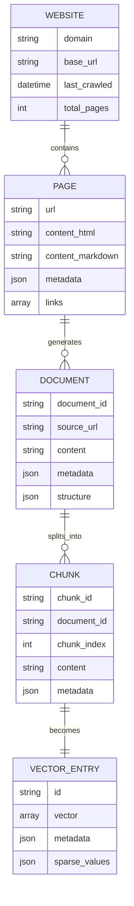

# Data Model Documentation

## Overview

DocScraper uses a pipeline-based data model that transforms web content through multiple stages, from raw HTML to vector-database-ready chunks. Each stage enriches the data with additional metadata and structure.

## Data Flow Stages


## Core Data Structures

### 1. Scraped Page

Raw scraped content from web pages.

```python
{
    "url": "https://docs.example.com/guide/intro",
    "domain": "docs.example.com",
    "path": "/guide/intro",
    "title": "Introduction Guide",
    "content_html": "<html>...</html>",
    "content_markdown": "# Introduction Guide\n...",
    "metadata": {
        "scraped_at": "2024-01-28T10:30:00Z",
        "status_code": 200,
        "content_type": "text/html",
        "encoding": "utf-8",
        "size_bytes": 15234
    },
    "links": [
        "https://docs.example.com/guide/setup",
        "https://docs.example.com/guide/usage"
    ],
    "images": [
        {
            "src": "/images/diagram.png",
            "alt": "Architecture Diagram",
            "absolute_url": "https://docs.example.com/images/diagram.png"
        }
    ],
    "code_blocks": [
        {
            "language": "python",
            "content": "import example\n...",
            "line_count": 10
        }
    ]
}
```

### 2. Processed Document

Cleaned and structured document ready for chunking.

```python
{
    "document_id": "guide_intro_001",
    "source_url": "https://docs.example.com/guide/intro",
    "file_path": "cleaned/0001_guide_intro.md",
    "title": "Introduction Guide",
    "content": "# Introduction Guide\n\nClean content without navigation...",
    "metadata": {
        "category": "guides",
        "complexity_score": 0.3,
        "word_count": 1250,
        "reading_time_minutes": 5,
        "has_code": true,
        "has_images": true,
        "processed_at": "2024-01-28T11:00:00Z"
    },
    "structure": {
        "headings": [
            {"level": 1, "text": "Introduction Guide", "position": 0},
            {"level": 2, "text": "Getting Started", "position": 150},
            {"level": 2, "text": "Core Concepts", "position": 450}
        ],
        "sections": [
            {
                "title": "Getting Started",
                "start": 150,
                "end": 450,
                "subsections": []
            }
        ]
    },
    "dependencies": {
        "references": ["setup.md", "configuration.md"],
        "referenced_by": ["advanced.md", "troubleshooting.md"]
    }
}
```

### 3. Document Chunk

Optimized chunk for embedding and retrieval.

```python
{
    "chunk_id": "guide_intro_001_chunk_002",
    "document_id": "guide_intro_001",
    "chunk_index": 2,
    "total_chunks": 8,
    "content": "Core Concepts section content...",
    "metadata": {
        "source_url": "https://docs.example.com/guide/intro",
        "document_title": "Introduction Guide",
        "section_title": "Core Concepts",
        "category": "guides",
        "complexity_score": 0.3,
        "token_count": 850,
        "char_count": 4200,
        "has_code": false,
        "language": "en",
        "chunk_type": "section"
    },
    "context": {
        "previous_chunk_id": "guide_intro_001_chunk_001",
        "next_chunk_id": "guide_intro_001_chunk_003",
        "parent_section": "Introduction Guide",
        "depth": 2
    },
    "embeddings": {
        "model": "text-embedding-ada-002",
        "vector": null,  // Populated by embedding service
        "dimension": 1536
    }
}
```

### 4. Vector Database Entry

Final format for vector database ingestion.

```python
{
    "id": "guide_intro_001_chunk_002",
    "values": [0.0123, -0.0456, ...],  // 1536-dimensional vector
    "metadata": {
        "text": "Core Concepts section content...",
        "source": "https://docs.example.com/guide/intro",
        "title": "Introduction Guide - Core Concepts",
        "category": "guides",
        "complexity": 0.3,
        "tokens": 850,
        "chunk_index": 2,
        "total_chunks": 8,
        "timestamp": "2024-01-28T11:00:00Z"
    },
    "sparse_values": {  // Optional: for hybrid search
        "indices": [123, 456, 789],
        "values": [0.5, 0.3, 0.2]
    }
}
```

## Entity Relationships



## Processing Pipeline Details

### Stage 1: HTML to Markdown

**Input**: Raw HTML from web page
**Process**: 
- Parse HTML with BeautifulSoup
- Convert to Markdown using crawl4ai
- Preserve code blocks and formatting
- Extract links and images

**Output**: Markdown document with metadata

### Stage 2: Document Cleaning

**Input**: Raw Markdown document
**Process**:
- Remove navigation elements
- Strip headers/footers
- Eliminate duplicate content
- Normalize formatting

**Output**: Clean Markdown document

### Stage 3: Document Structuring

**Input**: Clean Markdown document
**Process**:
- Parse heading hierarchy
- Identify sections and subsections
- Calculate complexity metrics
- Extract dependencies

**Output**: Structured document with metadata

### Stage 4: Chunking

**Input**: Structured document
**Process**:
- Split by semantic boundaries
- Apply chunk size limits
- Add overlap for context
- Generate chunk metadata

**Output**: Array of document chunks

### Stage 5: Vector Preparation

**Input**: Document chunks
**Process**:
- Format for embedding service
- Add retrieval metadata
- Generate unique IDs
- Prepare batch structure

**Output**: Vector database entries

## Metadata Schema

### Document Metadata

```yaml
title: string                    # Document title
description: string             # Brief description
category: enum                  # Category classification
  - getting_started
  - guides
  - api_reference
  - concepts
  - troubleshooting
complexity_score: float         # 0.0 to 1.0
word_count: integer            # Total words
reading_time: integer          # Estimated minutes
has_code: boolean              # Contains code blocks
has_images: boolean            # Contains images
has_tables: boolean            # Contains tables
language: string               # Content language (ISO 639-1)
last_modified: datetime        # Last modification date
processed_at: datetime         # Processing timestamp
```

### Chunk Metadata

```yaml
chunk_id: string               # Unique chunk identifier
document_id: string            # Parent document ID
chunk_index: integer           # Position in document
total_chunks: integer          # Total chunks in document
section_title: string          # Section heading
token_count: integer           # Number of tokens
char_count: integer            # Number of characters
chunk_type: enum               # Type of chunk
  - heading
  - paragraph
  - code
  - list
  - table
  - mixed
has_code: boolean              # Contains code
language: string               # Content language
complexity: float              # Inherited from document
```

## File Storage Structure

### Scraped Content
```
scraped_docs/
├── _scrape_summary.json       # Crawl statistics
├── _url_mapping.json          # URL to filename mapping
├── index.md                   # Homepage content
├── getting-started.md         # Individual pages
├── guides/
│   ├── intro.md
│   └── advanced.md
└── api/
    ├── endpoints.md
    └── authentication.md
```

### Processed Content
```
processed_docs/
├── processing_summary.json    # Processing statistics
├── vector_db_index.json      # Ready for vector DB
├── cleaned/                   # Cleaned documents
│   ├── 0000_index.md
│   ├── 0001_getting-started.md
│   └── ...
├── chunks/                    # Document chunks
│   ├── 0000_index/
│   │   ├── chunk_000.json
│   │   ├── chunk_001.json
│   │   └── metadata.json
│   └── ...
└── metadata/                  # Document metadata
    ├── categories.json
    ├── dependencies.json
    └── complexity_scores.json
```

## Indexing Strategy

### Primary Indexes
- **chunk_id**: Unique identifier for each chunk
- **document_id**: Groups chunks by document
- **category**: Enables category-based filtering
- **complexity_score**: Supports progressive learning

### Secondary Indexes
- **source_url**: Links back to original content
- **section_title**: Enables section-level search
- **has_code**: Filters for code examples
- **language**: Language-specific filtering

## Query Patterns

### Semantic Search
```python
# Find similar content
results = vector_db.query(
    vector=query_embedding,
    top_k=10,
    filter={"category": "guides"}
)
```

### Metadata Filtering
```python
# Find beginner-friendly content with code
results = vector_db.query(
    vector=query_embedding,
    filter={
        "complexity": {"$lte": 0.3},
        "has_code": True
    }
)
```

### Progressive Learning
```python
# Get documents in learning order
documents = sorted(
    all_documents,
    key=lambda x: (x["complexity_score"], x["dependencies_count"])
)
```

## Data Validation

### Schema Validation
- Required fields enforcement
- Type checking
- Range validation for scores
- URL format validation

### Content Validation
- Minimum/maximum chunk sizes
- UTF-8 encoding verification
- Markdown syntax validation
- Link integrity checking

## Performance Considerations

### Chunking Strategy
- **Optimal chunk size**: 800-1200 tokens
- **Overlap**: 15-20% for context preservation
- **Boundary detection**: Respect semantic boundaries

### Storage Optimization
- **Compression**: Gzip for large documents
- **Deduplication**: Content-based hashing
- **Lazy loading**: Stream large files
- **Caching**: LRU cache for frequent queries

### Index Optimization
- **Denormalization**: Duplicate metadata for faster queries
- **Partitioning**: Separate by category/date
- **Batch operations**: Process in groups of 100-500