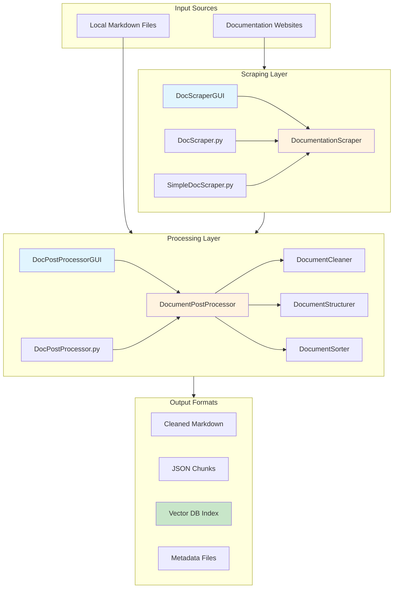

# DocScraper System Overview

## Purpose

DocScraper is a comprehensive Python toolkit designed to scrape documentation websites and post-process the content for optimal use in vector databases and Large Language Model (LLM) applications. It addresses the common challenge of converting web-based documentation into structured, searchable, and AI-ready formats.

## Key User Journeys

### 1. Documentation Engineer
**Goal**: Convert entire documentation sites into structured markdown
- Uses GUI or CLI to scrape documentation websites
- Monitors progress in real-time
- Reviews failed URLs and retries as needed
- Exports clean markdown files for further processing

### 2. AI/ML Developer
**Goal**: Prepare documentation for vector database ingestion
- Processes scraped docs through the post-processor
- Configures chunk sizes for embedding models
- Uses LLM classification for better categorization
- Loads vector_db_index.json into their preferred database

### 3. Content Curator
**Goal**: Clean and organize technical documentation
- Removes navigation and boilerplate content
- Structures documents hierarchically
- Sorts by complexity for progressive learning
- Consolidates multi-source documentation

## System Architecture

## Technology Stack

### Core Technologies
- **Python 3.13+**: Primary programming language
- **AsyncIO**: Asynchronous crawling and processing
- **Tkinter**: Cross-platform GUI framework
- **BeautifulSoup4**: HTML parsing and content extraction

### Key Dependencies
- **crawl4ai**: Advanced web crawling with JavaScript support
- **Playwright**: Browser automation for dynamic content
- **OpenAI API**: LLM-powered document classification
- **NetworkX**: Document dependency analysis
- **scikit-learn**: Text processing and similarity calculations

### External Integrations
- **Vector Databases**: Pinecone, Weaviate, ChromaDB, Qdrant
- **LLM Providers**: OpenAI, Anthropic, local models
- **Documentation Sites**: Any public documentation website

## Key Scripts and Entry Points

### Scraping Tools
| Script | Purpose | Default Port/Config |
|--------|---------|-------------------|
| `DocScraperGUI.py` | GUI interface for web scraping | Tkinter GUI |
| `DocScraper.py` | Advanced CLI scraper with parallel processing | CLI |
| `SimpleDocScraper.py` | Sequential scraper for simple needs | CLI |

### Processing Tools
| Script | Purpose | Default Port/Config |
|--------|---------|-------------------|
| `DocPostProcessorGUI.py` | GUI for document post-processing | Tkinter GUI |
| `DocPostProcessor.py` | CLI post-processor with LLM support | CLI |
| `process_docs_example.py` | Example processing workflows | CLI |
| `process_multi_folder_example.py` | Multi-folder processing demo | CLI |

## Configuration

### Environment Variables
- `OPENAI_API_KEY`: Required for LLM-powered classification
- Stored in `.env` file (not committed to version control)

### Default Settings
- **Max Pages**: 100 (configurable)
- **Chunk Size**: 1000 tokens
- **Chunk Overlap**: 200 tokens
- **Rate Limiting**: Built-in delays between requests
- **Output Directory**: `scraped_docs/` and `processed_docs/`

## Data Flow

1. **Discovery Phase**
   - Start from documentation homepage
   - Discover internal links recursively
   - Filter non-documentation URLs

2. **Scraping Phase**
   - Fetch HTML content with Playwright
   - Convert to markdown with crawl4ai
   - Save with structured filenames

3. **Cleaning Phase**
   - Remove headers, footers, navigation
   - Strip duplicate content
   - Preserve code blocks and tables

4. **Structuring Phase**
   - Parse document hierarchy
   - Create semantic chunks
   - Add metadata tags

5. **Sorting Phase**
   - Categorize by document type
   - Calculate complexity scores
   - Order for optimal learning

6. **Export Phase**
   - Generate vector_db_index.json
   - Create chunk directories
   - Save processing summary

## Performance Characteristics

- **Scraping Speed**: ~1-3 pages/second (with rate limiting)
- **Processing Speed**: ~10-20 documents/second
- **Memory Usage**: ~500MB for 1000 documents
- **Chunk Generation**: ~5-10 chunks per document
- **LLM Classification**: ~1-2 seconds per document

## Security Considerations

- Respects robots.txt files
- Built-in rate limiting to avoid overwhelming servers
- API keys stored securely in environment variables
- No execution of scraped JavaScript code
- Sanitizes filenames to prevent path traversal

## Next Steps

1. Review the [Architecture Documentation](./architecture.md) for detailed component design
2. Follow the [Development Setup Guide](./dev-setup.md) to get started
3. Check the [API Documentation](./api.md) for integration details
4. Read the [Testing Guide](./testing.md) for quality assurance