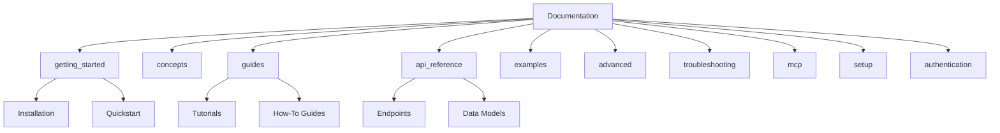
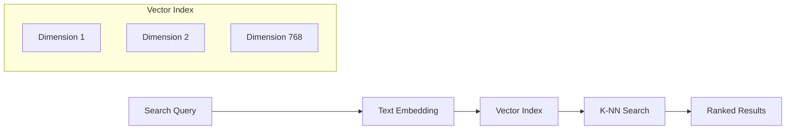
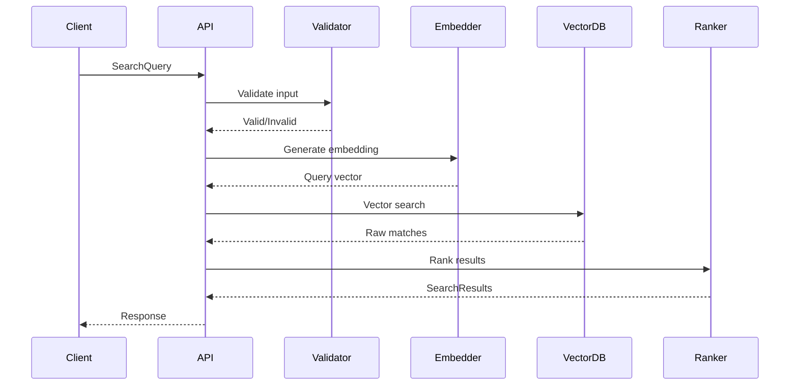

# Data Models & Schema Documentation

## Overview

The MCP Vector Server uses strongly-typed Pydantic models to ensure data integrity and provide comprehensive validation. This document details all data structures used in the system.

## Core Data Models

### ChunkMetadata

Metadata associated with each documentation chunk, providing context and categorization.

```python
class ChunkMetadata(BaseModel):
    type: str                          # Content type: "text" or "code"
    source_url: Optional[str]          # Original documentation URL
    scraped_at: Optional[str]          # Timestamp of data collection
    doc_title: Optional[str]           # Title of source document
    category: Optional[str]            # Documentation category
    complexity: Optional[float]        # Complexity score (0.0-1.0)
    parent_title: Optional[str]        # Parent section title
    source_file: Optional[str]         # Source file path
    section_level: Optional[int]       # Heading level (1-6)
    section_title: Optional[str]       # Current section title
```

**Field Descriptions**:
- `type`: Distinguishes between prose documentation ("text") and code examples ("code")
- `complexity`: ML-derived score indicating technical complexity (0=basic, 1=advanced)
- `section_level`: Corresponds to HTML heading levels for hierarchy
- `category`: Maps to predefined categories (see Category System below)

### DocumentChunk

The primary data structure representing a searchable documentation fragment.

```python
class DocumentChunk(BaseModel):
    chunk_id: str                      # Unique identifier
    content: str                       # Actual documentation content
    metadata: ChunkMetadata            # Associated metadata
    parent_doc: Optional[str]          # Parent document ID
    position: Optional[int]            # Position within parent
    tokens: Optional[int]              # Token count for context limits
```

**Key Constraints**:
- `chunk_id`: Must be globally unique across the database
- `content`: Maximum 8192 characters for optimal embedding
- `tokens`: Used for context window management in LLMs
- `position`: Zero-indexed position for maintaining document order

### SearchResult

Represents a single search result with relevance scoring.

```python
class SearchResult(BaseModel):
    chunk: DocumentChunk               # Matched documentation chunk
    similarity: float                  # Similarity score (0.0-1.0)
    rank: int                         # Result ranking (1-based)
```

**Similarity Scoring**:
- `1.0`: Perfect semantic match
- `0.8-1.0`: Highly relevant
- `0.6-0.8`: Relevant
- `0.3-0.6`: Somewhat relevant
- `< 0.3`: Low relevance (typically filtered)

### SearchQuery

Parameters for executing a semantic search.

```python
class SearchQuery(BaseModel):
    query: str                        # Natural language search query
    limit: int = 10                   # Maximum results (1-100)
    category: Optional[str]           # Filter by category
    technology: Optional[str]         # Filter by technology
    doc_type: Optional[str]          # Filter by type (text/code)
    min_similarity: float = 0.3      # Minimum similarity threshold
```

**Validation Rules**:
- `query`: Required, minimum 1 character, maximum 1000 characters
- `limit`: Must be between 1 and 100
- `min_similarity`: Must be between 0.0 and 1.0
- `category`: Must match predefined categories if provided
- `technology`: Must match supported technologies if provided

### TechnologyMapping

Configuration for technology-specific documentation organization.

```python
class TechnologyMapping(BaseModel):
    name: str                         # Technology display name
    keywords: List[str]               # Search keywords/aliases
    categories: List[str]             # Relevant categories
    file_patterns: List[str]          # File naming patterns
```

## Category System

### Predefined Categories

The system uses a fixed set of categories for consistent organization:

```python
CATEGORY_DESCRIPTIONS = {
    "getting_started": "Quick start guides and installation instructions",
    "concepts": "Core concepts and architectural explanations",
    "guides": "Step-by-step tutorials and how-to guides",
    "api_reference": "API documentation and reference materials",
    "examples": "Code examples and sample implementations",
    "advanced": "Advanced topics and detailed configurations",
    "troubleshooting": "Common issues and solutions",
    "mcp": "Model Context Protocol related documentation",
    "setup": "Installation and setup instructions",
    "authentication": "Authentication and security documentation"
}
```

### Category Hierarchy



## Technology Mappings

### Supported Technologies

Each technology has specific metadata for optimal search:

```python
TECH_MAPPINGS = [
    TechnologyMapping(
        name="Convex",
        keywords=["convex", "database", "backend", "realtime"],
        categories=["getting_started", "guides", "api_reference"],
        file_patterns=["*Convex*", "*convex*"]
    ),
    TechnologyMapping(
        name="Shadcn/ui",
        keywords=["shadcn", "ui", "components", "design system"],
        categories=["getting_started", "guides", "examples"],
        file_patterns=["*Shadcn*", "*shadcn*"]
    ),
    # ... additional mappings
]
```

### Technology Keywords

| Technology | Primary Keywords | Secondary Keywords |
|------------|-----------------|-------------------|
| Convex | convex, database | backend, realtime, sync |
| Shadcn/ui | shadcn, ui | components, design-system |
| RadixUI | radix, primitives | themes, colors, ui |
| TailwindCSS | tailwind, css | styling, utility, classes |
| React | react, jsx | components, hooks, state |
| Claude Code | claude, code | anthropic, ai, mcp |
| Kiro | kiro, mcp | agent, ai, automation |
| Clerk | clerk, auth | authentication, user, session |
| Polar | polar, billing | subscriptions, payments |

## Vector Database Schema

### Embedding Storage

Documentation chunks are stored with their vector embeddings:

```python
class VectorRecord:
    chunk_id: str                     # Primary key
    embedding: np.ndarray             # 768-dimensional vector
    chunk_data: DocumentChunk         # Full chunk data
    created_at: datetime              # Creation timestamp
    updated_at: datetime              # Last update timestamp
```

### Index Structure



## Data Validation

### Input Validation

All input data is validated using Pydantic's strict mode:

```python
# Example validation
try:
    query = SearchQuery(
        query="How to use Convex?",
        limit=5,
        category="guides",
        min_similarity=0.5
    )
except ValidationError as e:
    # Handle validation errors
    print(f"Invalid input: {e}")
```

### Common Validation Errors

| Field | Error | Description | Fix |
|-------|-------|-------------|-----|
| `query` | Required field | Query not provided | Include query string |
| `limit` | Out of range | Limit > 100 or < 1 | Use 1-100 range |
| `category` | Invalid choice | Unknown category | Use predefined category |
| `min_similarity` | Out of range | Not between 0-1 | Use 0.0-1.0 range |
| `technology` | Invalid choice | Unknown technology | Use supported tech |

## Data Flow

### Search Request Flow



## Performance Considerations

### Chunk Size Optimization

- **Optimal size**: 200-500 tokens
- **Maximum size**: 8192 characters
- **Reasoning**: Balance between context and search precision

### Embedding Dimensions

- **Model**: sentence-transformers/all-MiniLM-L6-v2
- **Dimensions**: 768
- **Trade-off**: Accuracy vs. storage/compute

### Index Performance

| Operation | Complexity | Typical Time |
|-----------|------------|--------------|
| Single search | O(log n) | < 100ms |
| Batch search | O(k log n) | < 500ms |
| Index update | O(log n) | < 50ms |
| Full rebuild | O(n log n) | ~ 5 minutes |

## Migration & Versioning

### Schema Versioning

```python
SCHEMA_VERSION = "1.0.0"

class SchemaVersion(BaseModel):
    version: str
    compatible_versions: List[str]
    migration_required: bool
```

### Migration Strategy

1. **Backward Compatible**: Add optional fields only
2. **Breaking Changes**: Require migration script
3. **Version Check**: Validate on server startup

## Best Practices

### Data Quality

1. **Content Chunking**:
   - Maintain semantic coherence
   - Preserve context boundaries
   - Include section headers

2. **Metadata Enrichment**:
   - Always populate category
   - Include source URLs
   - Maintain timestamp accuracy

3. **Search Optimization**:
   - Use specific queries
   - Apply appropriate filters
   - Set reasonable limits

### Security Considerations

1. **Input Sanitization**: All inputs validated and sanitized
2. **SQL Injection**: Not applicable (vector DB)
3. **Data Privacy**: No PII in documentation chunks
4. **Rate Limiting**: Prevent abuse through limits

## Future Enhancements

### Planned Model Updates

- [ ] Multi-language support
- [ ] Code syntax highlighting metadata
- [ ] Version tracking for documentation
- [ ] User feedback integration
- [ ] Dynamic complexity scoring

### Schema Evolution

- [ ] Nested chunk relationships
- [ ] Cross-reference tracking
- [ ] Change history
- [ ] Quality metrics