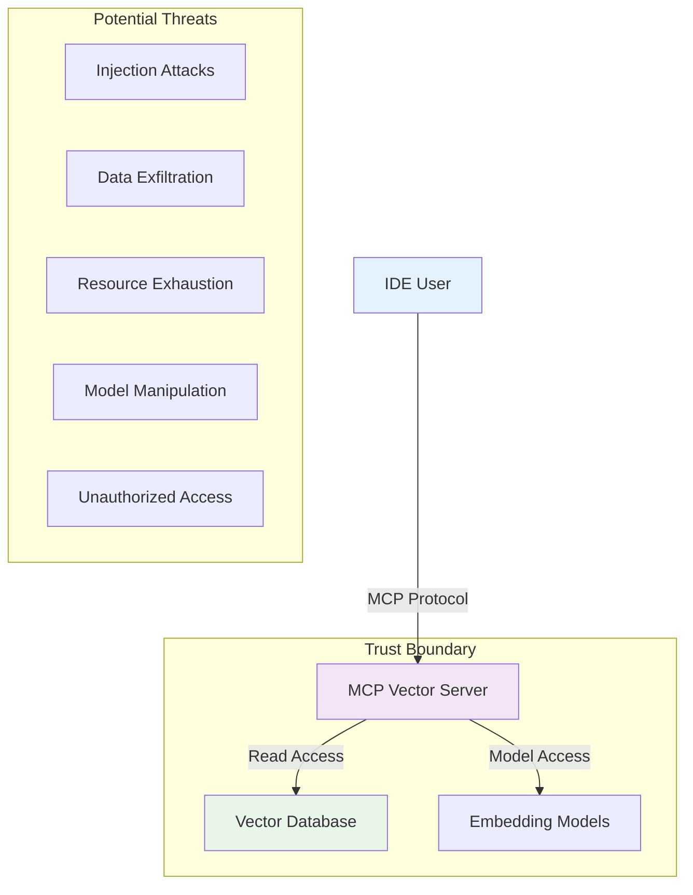

# Security Practices

## Overview

The MCP Vector Server implements comprehensive security measures to protect against common vulnerabilities and ensure safe operation in production environments. This guide outlines security best practices, threat models, and mitigation strategies.

## Security Architecture

### Threat Model



### Security Layers

| Layer | Protection | Implementation |
|-------|------------|----------------|
| **Input Validation** | Query sanitization, parameter validation | Pydantic models, length limits |
| **Access Control** | Request authentication, rate limiting | MCP protocol, request throttling |
| **Data Protection** | Sensitive data handling, encryption | No PII storage, secure paths |
| **Resource Management** | DoS prevention, memory limits | Request size limits, timeouts |
| **Error Handling** | Information disclosure prevention | Sanitized error messages |

## Input Security

### Query Validation

All user inputs are strictly validated to prevent injection attacks:

```python
class SearchQuery(BaseModel):
    """Secure search query validation."""
    
    query: str = Field(
        min_length=1,
        max_length=1000,
        description="Search query with length limits"
    )
    limit: int = Field(
        ge=1, 
        le=100, 
        default=10,
        description="Result limit prevents resource exhaustion"
    )
    category: Optional[str] = Field(
        regex=r'^[a-z_]+$',
        description="Category must match whitelist pattern"
    )
    
    @validator('query')
    def sanitize_query(cls, v):
        """Sanitize search query to prevent injection."""
        if not v or not v.strip():
            raise ValueError("Query cannot be empty")
        
        # Remove potentially dangerous characters
        sanitized = re.sub(r'[<>&"\'\\]', '', v.strip())
        
        # Check for suspicious patterns
        dangerous_patterns = [
            r'(union|select|insert|delete|drop|exec|script)',
            r'(javascript:|data:|vbscript:)',
            r'(<script|</script|<iframe|</iframe)'
        ]
        
        for pattern in dangerous_patterns:
            if re.search(pattern, sanitized, re.IGNORECASE):
                raise ValueError("Query contains prohibited content")
        
        return sanitized
```

### Parameter Sanitization

```python
def validate_technology_filter(technology: str) -> str:
    """Validate technology parameter against whitelist."""
    ALLOWED_TECHNOLOGIES = {
        'React', 'Convex', 'Shadcn/ui', 'RadixUI', 
        'TailwindCSS', 'Claude Code', 'Kiro', 'Clerk', 'Polar'
    }
    
    if technology not in ALLOWED_TECHNOLOGIES:
        raise ValueError(f"Unknown technology: {technology}")
    
    return technology

def validate_category_filter(category: str) -> str:
    """Validate category parameter against predefined list."""
    ALLOWED_CATEGORIES = {
        'getting_started', 'concepts', 'guides', 'api_reference',
        'examples', 'advanced', 'troubleshooting', 'mcp', 
        'setup', 'authentication'
    }
    
    if category not in ALLOWED_CATEGORIES:
        raise ValueError(f"Unknown category: {category}")
    
    return category
```

## Access Control

### Request Authentication

While MCP protocol handles basic authentication, implement additional validation:

```python
class MCPRequestHandler:
    """Secure MCP request handling."""
    
    def __init__(self):
        self.rate_limiter = RateLimiter()
        self.request_validator = RequestValidator()
    
    async def handle_request(self, request: MCPRequest) -> MCPResponse:
        """Handle MCP request with security checks."""
        
        # Rate limiting
        if not self.rate_limiter.allow_request(request.client_id):
            raise SecurityError("Rate limit exceeded")
        
        # Request size validation
        if len(str(request)) > MAX_REQUEST_SIZE:
            raise SecurityError("Request too large")
        
        # Method validation
        if request.method not in ALLOWED_METHODS:
            raise SecurityError("Method not allowed")
        
        return await self.process_request(request)
```

### Rate Limiting

```python
class RateLimiter:
    """Token bucket rate limiter."""
    
    def __init__(self, 
                 requests_per_minute: int = 100,
                 burst_size: int = 10):
        self.requests_per_minute = requests_per_minute
        self.burst_size = burst_size
        self.clients = {}
    
    def allow_request(self, client_id: str) -> bool:
        """Check if request is allowed for client."""
        now = time.time()
        
        if client_id not in self.clients:
            self.clients[client_id] = {
                'tokens': self.burst_size,
                'last_refill': now
            }
        
        client = self.clients[client_id]
        
        # Refill tokens based on elapsed time
        elapsed = now - client['last_refill']
        tokens_to_add = elapsed * (self.requests_per_minute / 60)
        client['tokens'] = min(
            self.burst_size, 
            client['tokens'] + tokens_to_add
        )
        client['last_refill'] = now
        
        # Check if request can be served
        if client['tokens'] >= 1:
            client['tokens'] -= 1
            return True
        
        return False
```

## Data Protection

### Sensitive Data Handling

The vector server processes documentation content but must not store or log sensitive information:

```python
class SecureDataHandler:
    """Secure handling of documentation content."""
    
    SENSITIVE_PATTERNS = [
        r'[A-Za-z0-9+/]{40,}={0,2}',  # Base64-encoded data
        r'[A-Za-z0-9]{32}',           # MD5 hashes
        r'[A-Za-z0-9]{40}',           # SHA1 hashes
        r'sk-[A-Za-z0-9]{32}',        # API keys pattern
        r'AIza[0-9A-Za-z\\-_]{35}',   # Google API keys
        r'AKIA[0-9A-Z]{16}',          # AWS Access Keys
    ]
    
    def sanitize_content(self, content: str) -> str:
        """Remove sensitive data from content."""
        sanitized = content
        
        for pattern in self.SENSITIVE_PATTERNS:
            sanitized = re.sub(
                pattern, 
                '[REDACTED]', 
                sanitized, 
                flags=re.IGNORECASE
            )
        
        return sanitized
    
    def validate_safe_content(self, content: str) -> bool:
        """Verify content doesn't contain sensitive data."""
        for pattern in self.SENSITIVE_PATTERNS:
            if re.search(pattern, content, re.IGNORECASE):
                return False
        return True
```

### Database Security

```python
class SecureVectorDatabase:
    """Secure vector database operations."""
    
    def __init__(self, db_path: str):
        # Validate database path is safe
        self.db_path = self._validate_db_path(db_path)
        
        # Set restrictive file permissions
        os.chmod(self.db_path, 0o600)  # Read/write owner only
    
    def _validate_db_path(self, path: str) -> str:
        """Validate database path for security."""
        # Resolve path to prevent directory traversal
        resolved_path = os.path.realpath(path)
        
        # Ensure path is within allowed directories
        allowed_bases = ['/opt/vector-db', '/var/lib/vector-db', os.path.expanduser('~/vector-db')]
        
        if not any(resolved_path.startswith(base) for base in allowed_bases):
            raise SecurityError(f"Database path not allowed: {resolved_path}")
        
        return resolved_path
    
    def load_embeddings(self) -> np.ndarray:
        """Securely load embeddings with integrity check."""
        embeddings_file = os.path.join(self.db_path, 'embeddings.npy')
        
        # Verify file exists and is readable
        if not os.path.isfile(embeddings_file):
            raise SecurityError("Embeddings file not found")
        
        # Check file size to prevent memory exhaustion
        file_size = os.path.getsize(embeddings_file)
        if file_size > MAX_EMBEDDINGS_SIZE:
            raise SecurityError("Embeddings file too large")
        
        # Load with error handling
        try:
            embeddings = np.load(embeddings_file, allow_pickle=False)
            return embeddings
        except Exception as e:
            raise SecurityError(f"Failed to load embeddings: {e}")
```

## Resource Protection

### Memory Management

```python
class SecureResourceManager:
    """Manage system resources securely."""
    
    def __init__(self, max_memory_mb: int = 2048):
        self.max_memory_mb = max_memory_mb
        self.process = psutil.Process()
    
    def check_memory_usage(self):
        """Monitor memory usage and enforce limits."""
        memory_info = self.process.memory_info()
        memory_mb = memory_info.rss / 1024 / 1024
        
        if memory_mb > self.max_memory_mb:
            # Force garbage collection
            gc.collect()
            
            # Check again after cleanup
            memory_info = self.process.memory_info()
            memory_mb = memory_info.rss / 1024 / 1024
            
            if memory_mb > self.max_memory_mb:
                raise SecurityError(f"Memory limit exceeded: {memory_mb:.1f}MB > {self.max_memory_mb}MB")
    
    def limit_search_results(self, results: List, max_results: int = 100) -> List:
        """Limit result size to prevent resource exhaustion."""
        if len(results) > max_results:
            # Log potential abuse
            logger.warning(f"Large result set truncated: {len(results)} -> {max_results}")
            return results[:max_results]
        return results
```

### Request Timeouts

```python
import signal
from contextlib import contextmanager

@contextmanager
def timeout_protection(seconds: int):
    """Protect against long-running operations."""
    
    def timeout_handler(signum, frame):
        raise TimeoutError(f"Operation exceeded {seconds} second timeout")
    
    # Set the signal handler
    old_handler = signal.signal(signal.SIGALRM, timeout_handler)
    signal.alarm(seconds)
    
    try:
        yield
    finally:
        # Restore the old signal handler
        signal.alarm(0)
        signal.signal(signal.SIGALRM, old_handler)

# Usage in search operations
def secure_search(query: SearchQuery) -> List[SearchResult]:
    """Perform search with timeout protection."""
    with timeout_protection(SEARCH_TIMEOUT_SECONDS):
        return perform_search(query)
```

## Error Handling Security

### Safe Error Messages

```python
class SecureErrorHandler:
    """Handle errors without exposing sensitive information."""
    
    def __init__(self, debug_mode: bool = False):
        self.debug_mode = debug_mode
    
    def handle_error(self, error: Exception, context: str) -> dict:
        """Return sanitized error response."""
        
        # Log full error details for debugging
        logger.error(f"Error in {context}: {type(error).__name__}: {str(error)}")
        
        if self.debug_mode:
            # Development mode: return detailed error
            return {
                "error": {
                    "type": type(error).__name__,
                    "message": str(error),
                    "context": context
                }
            }
        else:
            # Production mode: return generic error
            error_map = {
                ValidationError: "Invalid input parameters",
                FileNotFoundError: "Requested resource not found",
                MemoryError: "Service temporarily unavailable",
                TimeoutError: "Request timeout",
                DatabaseError: "Service temporarily unavailable",
            }
            
            generic_message = error_map.get(type(error), "An unexpected error occurred")
            
            return {
                "error": {
                    "message": generic_message,
                    "code": "INTERNAL_ERROR"
                }
            }
```

### Logging Security

```python
import logging
from logging import Filter

class SensitiveDataFilter(Filter):
    """Filter sensitive data from log messages."""
    
    SENSITIVE_PATTERNS = [
        r'token["\']?\s*[:=]\s*["\']?([^"\'\\s]+)',
        r'key["\']?\s*[:=]\s*["\']?([^"\'\\s]+)',
        r'password["\']?\s*[:=]\s*["\']?([^"\'\\s]+)',
        r'secret["\']?\s*[:=]\s*["\']?([^"\'\\s]+)',
    ]
    
    def filter(self, record):
        """Filter sensitive data from log record."""
        message = record.getMessage()
        
        for pattern in self.SENSITIVE_PATTERNS:
            message = re.sub(pattern, r'***REDACTED***', message, flags=re.IGNORECASE)
        
        record.msg = message
        return True

# Configure secure logging
def setup_secure_logging():
    """Setup logging with sensitive data filtering."""
    
    # Create logger
    logger = logging.getLogger('mcp_vector_server')
    logger.setLevel(logging.INFO)
    
    # Create handler with secure format
    handler = logging.StreamHandler()
    formatter = logging.Formatter(
        '%(asctime)s - %(name)s - %(levelname)s - %(message)s',
        datefmt='%Y-%m-%d %H:%M:%S'
    )
    handler.setFormatter(formatter)
    
    # Add sensitive data filter
    handler.addFilter(SensitiveDataFilter())
    
    logger.addHandler(handler)
    return logger
```

## Deployment Security

### Environment Configuration

```bash
# .env.production - Secure environment configuration
# Database
VECTOR_DB_PATH=/opt/secure/vector-database
DB_READ_ONLY=true

# Security settings  
RATE_LIMIT_REQUESTS_PER_MINUTE=60
RATE_LIMIT_BURST_SIZE=5
MAX_REQUEST_SIZE_BYTES=10240
SEARCH_TIMEOUT_SECONDS=5
MAX_MEMORY_MB=1024

# Logging
LOG_LEVEL=INFO
LOG_SANITIZE_SENSITIVE=true
LOG_MAX_SIZE_MB=100
LOG_BACKUP_COUNT=5

# Features
ENABLE_DEBUG_MODE=false
ENABLE_PROFILING=false
ENABLE_METRICS=true
```

### File Permissions

```bash
#!/bin/bash
# scripts/secure_deployment.sh - Set secure file permissions

# Vector database - read-only for service account
chown -R vector-server:vector-server /opt/vector-database
chmod -R 400 /opt/vector-database
chmod 500 /opt/vector-database  # Directory needs execute for access

# Application files - read-only
chown -R vector-server:vector-server /opt/mcp-vector-server
chmod -R 444 /opt/mcp-vector-server/src
chmod 555 /opt/mcp-vector-server/src  # Directories need execute

# Logs directory - write access for service
mkdir -p /var/log/mcp-vector-server
chown vector-server:vector-server /var/log/mcp-vector-server
chmod 755 /var/log/mcp-vector-server

# Remove group/other permissions
chmod go-rwx /opt/vector-database
chmod go-rwx /opt/mcp-vector-server
```

### Process Isolation

```bash
# systemd service configuration
[Unit]
Description=MCP Vector Server
After=network.target

[Service]
Type=simple
User=vector-server
Group=vector-server
WorkingDirectory=/opt/mcp-vector-server

# Security restrictions
NoNewPrivileges=yes
ProtectSystem=strict
ProtectHome=yes
ReadWritePaths=/var/log/mcp-vector-server
ProtectKernelTunables=yes
ProtectKernelModules=yes
ProtectControlGroups=yes
PrivateDevices=yes
PrivateTmp=yes

# Resource limits
MemoryLimit=2G
CPUQuota=200%
TasksMax=50

# Environment
Environment=VECTOR_DB_PATH=/opt/vector-database
Environment=LOG_LEVEL=INFO
EnvironmentFile=/etc/mcp-vector-server/environment

ExecStart=/opt/mcp-vector-server/.venv/bin/python -m mcp_vector_server
Restart=on-failure

[Install]
WantedBy=multi-user.target
```

## Security Monitoring

### Audit Logging

```python
class SecurityAuditor:
    """Security event auditing."""
    
    def __init__(self):
        self.audit_logger = logging.getLogger('security_audit')
        self.audit_logger.setLevel(logging.INFO)
        
        # Create audit log handler
        handler = logging.FileHandler('/var/log/mcp-vector-server/audit.log')
        formatter = logging.Formatter(
            '%(asctime)s - AUDIT - %(levelname)s - %(message)s'
        )
        handler.setFormatter(formatter)
        self.audit_logger.addHandler(handler)
    
    def log_search_request(self, client_id: str, query: str, results_count: int):
        """Audit search requests."""
        self.audit_logger.info(
            f"SEARCH - Client: {client_id[:8]}... - "
            f"Query: {query[:50]}... - Results: {results_count}"
        )
    
    def log_rate_limit_violation(self, client_id: str, request_count: int):
        """Audit rate limit violations."""
        self.audit_logger.warning(
            f"RATE_LIMIT - Client: {client_id[:8]}... - "
            f"Requests: {request_count} - Action: BLOCKED"
        )
    
    def log_security_violation(self, client_id: str, violation_type: str, details: str):
        """Audit security violations."""
        self.audit_logger.error(
            f"SECURITY_VIOLATION - Client: {client_id[:8]}... - "
            f"Type: {violation_type} - Details: {details}"
        )
```

### Metrics Collection

```python
class SecurityMetrics:
    """Collect security-related metrics."""
    
    def __init__(self):
        self.metrics = {
            'requests_total': 0,
            'requests_blocked': 0,
            'errors_total': 0,
            'rate_limit_violations': 0,
            'invalid_queries': 0,
        }
        self.start_time = time.time()
    
    def increment_metric(self, metric_name: str):
        """Increment a security metric."""
        if metric_name in self.metrics:
            self.metrics[metric_name] += 1
    
    def get_security_summary(self) -> dict:
        """Get security metrics summary."""
        uptime = time.time() - self.start_time
        return {
            'uptime_seconds': uptime,
            'metrics': self.metrics,
            'error_rate': self.metrics['errors_total'] / max(self.metrics['requests_total'], 1),
            'block_rate': self.metrics['requests_blocked'] / max(self.metrics['requests_total'], 1)
        }
```

## Security Testing

### Penetration Testing

```python
# tests/security/test_input_validation.py
import pytest
from src.mcp_vector_server.models import SearchQuery, ValidationError

class TestInputSecurity:
    """Test input validation security."""
    
    @pytest.mark.parametrize("malicious_query", [
        "<script>alert('xss')</script>",
        "'; DROP TABLE users; --",
        "javascript:alert('xss')",
        "\x00\x01\x02",  # Null bytes
        "A" * 10000,     # Very long string
        "../../../etc/passwd",  # Path traversal
    ])
    def test_malicious_query_blocked(self, malicious_query):
        """Test that malicious queries are blocked."""
        with pytest.raises(ValidationError):
            SearchQuery(query=malicious_query)
    
    def test_rate_limiting(self):
        """Test rate limiting functionality."""
        from src.mcp_vector_server.security import RateLimiter
        
        limiter = RateLimiter(requests_per_minute=2, burst_size=2)
        client_id = "test_client"
        
        # First two requests should pass
        assert limiter.allow_request(client_id)
        assert limiter.allow_request(client_id)
        
        # Third request should be blocked
        assert not limiter.allow_request(client_id)
```

### Fuzzing Tests

```python
# tests/security/test_fuzzing.py
import pytest
import random
import string

class TestFuzzingSecurity:
    """Fuzzing tests for security vulnerabilities."""
    
    def test_random_query_fuzzing(self):
        """Test with random input strings."""
        for _ in range(100):
            # Generate random string
            length = random.randint(1, 1000)
            random_query = ''.join(
                random.choices(string.printable, k=length)
            )
            
            try:
                # Should not crash with any input
                SearchQuery(query=random_query)
            except ValidationError:
                # Validation error is expected and acceptable
                pass
            except Exception as e:
                # Any other exception is a security concern
                pytest.fail(f"Unexpected error with input: {random_query[:100]}... Error: {e}")
```

## Incident Response

### Security Incident Handling

```python
class SecurityIncidentHandler:
    """Handle security incidents."""
    
    def __init__(self):
        self.incident_log = logging.getLogger('security_incidents')
    
    def handle_potential_attack(self, attack_type: str, client_id: str, details: dict):
        """Handle potential security attack."""
        
        incident_id = self.generate_incident_id()
        
        # Log incident
        self.incident_log.critical(
            f"INCIDENT {incident_id} - {attack_type} - "
            f"Client: {client_id[:8]}... - Details: {details}"
        )
        
        # Take protective action
        if attack_type in ['SQL_INJECTION', 'XSS_ATTEMPT', 'PATH_TRAVERSAL']:
            self.block_client(client_id)
        
        # Notify security team (implement based on infrastructure)
        self.notify_security_team(incident_id, attack_type, details)
        
        return incident_id
    
    def generate_incident_id(self) -> str:
        """Generate unique incident ID."""
        import uuid
        return f"SEC-{uuid.uuid4().hex[:8].upper()}"
```

## Compliance & Standards

### Security Checklist

- [ ] **Input Validation**: All inputs validated with strict rules
- [ ] **Access Control**: Rate limiting and request validation implemented
- [ ] **Data Protection**: No sensitive data stored or logged
- [ ] **Resource Management**: Memory and CPU limits enforced
- [ ] **Error Handling**: Sanitized error messages in production
- [ ] **Logging**: Security events logged with sensitive data filtered
- [ ] **File Permissions**: Restrictive file and directory permissions
- [ ] **Process Isolation**: Service runs with minimal privileges
- [ ] **Monitoring**: Security metrics and audit logs collected
- [ ] **Testing**: Regular security testing and vulnerability scanning

### Security Reviews

Regular security assessments should include:

1. **Code Review**: Manual review of security-critical code paths
2. **Dependency Scanning**: Check for vulnerable dependencies
3. **Penetration Testing**: Automated and manual security testing
4. **Configuration Review**: Verify secure deployment configurations
5. **Monitoring Review**: Ensure security events are properly detected

### Vulnerability Management

```bash
# Regular security updates
uv sync --upgrade

# Dependency vulnerability scanning
uv run safety check
uv run pip-audit

# Static code analysis
uv run bandit -r src/

# Security linting
uv run semgrep --config=security src/
```

---

*Security is an ongoing process, not a one-time setup. Regular review and updates of these practices are essential.* 🔒