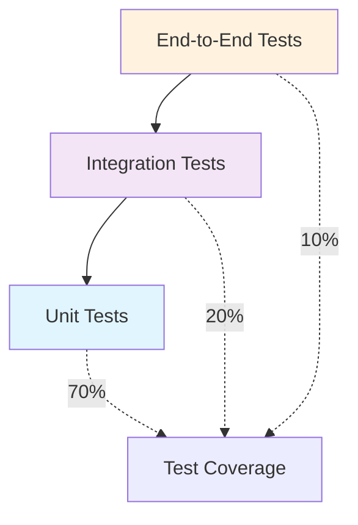

# Testing Guide

## Overview

The MCP Vector Server maintains high code quality through comprehensive testing strategies. This guide covers our testing approach, tools, and best practices.

## Testing Strategy

### Test Pyramid



| Test Level | Coverage | Purpose | Execution Time |
|------------|----------|---------|----------------|
| **Unit** | 70% | Individual functions/classes | < 1 second |
| **Integration** | 20% | Component interactions | < 30 seconds |
| **End-to-End** | 10% | Full system workflows | < 2 minutes |

## Running Tests

### Quick Commands

```bash
# Run all tests
uv run pytest

# Run with coverage
uv run pytest --cov=src/mcp_vector_server

# Run specific test file
uv run pytest tests/test_models.py

# Run tests matching pattern
uv run pytest -k "search"

# Run with verbose output
uv run pytest -v -s
```

### Test Configuration

#### pytest.ini
```ini
[tool:pytest]
testpaths = tests
python_files = test_*.py
python_classes = Test*
python_functions = test_*
addopts = 
    --cov=src/mcp_vector_server
    --cov-report=html
    --cov-report=term-missing
    --cov-fail-under=90
markers =
    unit: Unit tests
    integration: Integration tests
    performance: Performance tests
    slow: Slow-running tests
```

### Coverage Requirements

- **Minimum Coverage**: 90%
- **New Code**: 100% coverage required
- **Critical Paths**: 100% coverage required (search, validation)
- **Documentation**: Test docstrings for all public APIs

```bash
# Generate coverage report
uv run pytest --cov=src/mcp_vector_server --cov-report=html

# View coverage report
open htmlcov/index.html

# Check coverage thresholds
uv run coverage report --fail-under=90
```

## Unit Testing

### Test Structure

```python
# tests/test_models.py
import pytest
from pydantic import ValidationError
from src.mcp_vector_server.models import SearchQuery, DocumentChunk

class TestSearchQuery:
    """Test SearchQuery model validation and behavior."""
    
    def test_valid_query_creation(self):
        """Test creating a valid SearchQuery."""
        query = SearchQuery(
            query="How to use React hooks?",
            limit=5,
            category="guides"
        )
        
        assert query.query == "How to use React hooks?"
        assert query.limit == 5
        assert query.category == "guides"
        assert query.min_similarity == 0.3  # Default value
    
    def test_query_validation_empty_string(self):
        """Test validation fails for empty query."""
        with pytest.raises(ValidationError) as exc_info:
            SearchQuery(query="", limit=10)
        
        assert "query cannot be empty" in str(exc_info.value)
    
    def test_limit_validation_out_of_range(self):
        """Test validation fails for invalid limit."""
        with pytest.raises(ValidationError) as exc_info:
            SearchQuery(query="test", limit=101)
        
        assert "limit must be between 1 and 100" in str(exc_info.value)
    
    @pytest.mark.parametrize("limit", [1, 10, 50, 100])
    def test_valid_limits(self, limit):
        """Test various valid limit values."""
        query = SearchQuery(query="test", limit=limit)
        assert query.limit == limit
```

### Testing Patterns

#### Fixtures for Test Data
```python
# tests/conftest.py
import pytest
from src.mcp_vector_server.models import DocumentChunk, ChunkMetadata

@pytest.fixture
def sample_chunk():
    """Sample DocumentChunk for testing."""
    return DocumentChunk(
        chunk_id="test_001",
        content="React hooks provide state management in functional components.",
        metadata=ChunkMetadata(
            type="text",
            category="guides",
            doc_title="React Hooks Guide",
            source_url="https://react.dev/hooks"
        ),
        position=1,
        tokens=12
    )

@pytest.fixture
def search_results(sample_chunk):
    """Sample search results for testing."""
    from src.mcp_vector_server.models import SearchResult
    
    return [
        SearchResult(chunk=sample_chunk, similarity=0.95, rank=1),
        SearchResult(chunk=sample_chunk, similarity=0.87, rank=2),
    ]
```

#### Mock External Dependencies
```python
# tests/test_search.py
from unittest.mock import patch, MagicMock
import numpy as np
import pytest

@patch('src.mcp_vector_server.embeddings.SentenceTransformer')
def test_generate_embedding(mock_transformer):
    """Test embedding generation with mocked transformer."""
    # Setup mock
    mock_model = MagicMock()
    mock_model.encode.return_value = np.array([0.1, 0.2, 0.3, 0.4])
    mock_transformer.return_value = mock_model
    
    # Test
    from src.mcp_vector_server.embeddings import generate_embedding
    result = generate_embedding("test query")
    
    # Assertions
    assert isinstance(result, np.ndarray)
    assert result.shape == (4,)
    mock_model.encode.assert_called_once_with("test query")
```

#### Exception Testing
```python
def test_invalid_similarity_threshold():
    """Test error handling for invalid similarity threshold."""
    with pytest.raises(ValueError, match="Similarity threshold must be between 0 and 1"):
        search_documentation("query", min_similarity=1.5)

def test_database_connection_error():
    """Test handling of database connection failures."""
    with patch('src.mcp_vector_server.database.load_database') as mock_load:
        mock_load.side_effect = ConnectionError("Database unavailable")
        
        with pytest.raises(DatabaseError):
            initialize_search_engine()
```

## Integration Testing

### Component Integration

```python
# tests/integration/test_search_integration.py
import pytest
from src.mcp_vector_server.search import SearchEngine
from src.mcp_vector_server.models import SearchQuery

class TestSearchIntegration:
    """Integration tests for search functionality."""
    
    @pytest.fixture
    def search_engine(self):
        """Initialize search engine with test data."""
        engine = SearchEngine()
        engine.load_test_database()  # Load minimal test data
        return engine
    
    def test_full_search_workflow(self, search_engine):
        """Test complete search workflow."""
        # Execute search
        results = search_engine.search(
            SearchQuery(
                query="React hooks tutorial",
                limit=3,
                technology="React"
            )
        )
        
        # Validate results
        assert len(results) <= 3
        assert all(result.similarity > 0.3 for result in results)
        
        # Check ordering (highest similarity first)
        similarities = [result.similarity for result in results]
        assert similarities == sorted(similarities, reverse=True)
        
        # Validate result structure
        for result in results:
            assert result.chunk.chunk_id
            assert result.chunk.content
            assert result.chunk.metadata.category
```

### Database Integration

```python
# tests/integration/test_database_integration.py
def test_vector_database_operations():
    """Test vector database operations."""
    from src.mcp_vector_server.database import VectorDatabase
    
    db = VectorDatabase()
    
    # Test chunk retrieval
    chunk = db.get_chunk("test_chunk_001")
    assert chunk is not None
    assert chunk.chunk_id == "test_chunk_001"
    
    # Test similarity search
    embedding = np.array([0.1] * 768)  # 768-dimensional test vector
    results = db.similarity_search(embedding, limit=5)
    
    assert len(results) <= 5
    assert all(0 <= result.similarity <= 1 for result in results)
```

### MCP Protocol Integration

```python
# tests/integration/test_mcp_integration.py
def test_mcp_tool_execution():
    """Test MCP tool execution workflow."""
    from src.mcp_vector_server.server import MCPServer
    
    server = MCPServer()
    
    # Test tool discovery
    tools = server.list_tools()
    assert "search_documentation" in [tool.name for tool in tools]
    
    # Test tool execution
    result = server.call_tool(
        "search_documentation",
        {
            "query": "authentication guide",
            "limit": 3,
            "technology": "Clerk"
        }
    )
    
    assert "results" in result
    assert len(result["results"]) <= 3
```

## Performance Testing

### Response Time Testing

```python
# tests/performance/test_search_performance.py
import time
import pytest

@pytest.mark.performance
class TestSearchPerformance:
    """Performance tests for search operations."""
    
    def test_search_latency_sla(self):
        """Test search meets sub-second SLA."""
        from src.mcp_vector_server.search import search_documentation
        
        start_time = time.time()
        
        results = search_documentation(
            query="complex authentication workflow with multiple providers",
            limit=10
        )
        
        elapsed_time = time.time() - start_time
        
        # SLA: Sub-second response time
        assert elapsed_time < 1.0, f"Search took {elapsed_time:.2f}s, exceeds 1.0s SLA"
        assert len(results) > 0, "Search returned no results"
    
    def test_concurrent_search_performance(self):
        """Test performance under concurrent load."""
        import concurrent.futures
        
        def perform_search(query_id):
            return search_documentation(f"test query {query_id}")
        
        start_time = time.time()
        
        with concurrent.futures.ThreadPoolExecutor(max_workers=10) as executor:
            futures = [
                executor.submit(perform_search, i) 
                for i in range(50)
            ]
            results = [future.result() for future in futures]
        
        elapsed_time = time.time() - start_time
        
        # Should handle 50 concurrent requests in reasonable time
        assert elapsed_time < 5.0
        assert all(len(result) > 0 for result in results)
```

### Memory Usage Testing

```python
import tracemalloc
import pytest

@pytest.mark.performance
def test_memory_usage():
    """Test memory usage stays within acceptable limits."""
    tracemalloc.start()
    
    # Perform memory-intensive operation
    results = []
    for i in range(1000):
        result = search_documentation(f"memory test query {i}")
        results.append(result)
    
    current, peak = tracemalloc.get_traced_memory()
    tracemalloc.stop()
    
    # Memory limits (adjust based on requirements)
    max_memory_mb = 200
    assert peak < max_memory_mb * 1024 * 1024, f"Peak memory {peak/1024/1024:.1f}MB exceeds {max_memory_mb}MB limit"
```

### Benchmark Integration

```python
# tests/performance/test_benchmarks.py
import pytest

@pytest.mark.benchmark(group="search")
def test_search_benchmark(benchmark):
    """Benchmark search operation."""
    result = benchmark(
        search_documentation,
        query="React hooks best practices",
        limit=10
    )
    assert len(result) > 0

@pytest.mark.benchmark(group="embedding")
def test_embedding_benchmark(benchmark):
    """Benchmark embedding generation."""
    from src.mcp_vector_server.embeddings import generate_embedding
    
    result = benchmark(
        generate_embedding,
        "This is a test query for benchmarking"
    )
    assert result.shape[0] > 0
```

## End-to-End Testing

### MCP Server E2E Testing

```python
# tests/e2e/test_mcp_server_e2e.py
import subprocess
import time
import json
import pytest

@pytest.mark.e2e
class TestMCPServerE2E:
    """End-to-end tests for MCP server."""
    
    @pytest.fixture(scope="class")
    def mcp_server_process(self):
        """Start MCP server process for testing."""
        process = subprocess.Popen(
            ["uv", "run", "mcp-vector-server"],
            stdin=subprocess.PIPE,
            stdout=subprocess.PIPE,
            stderr=subprocess.PIPE,
            text=True
        )
        
        # Allow server to start
        time.sleep(2)
        
        yield process
        
        # Cleanup
        process.terminate()
        process.wait()
    
    def test_tool_discovery(self, mcp_server_process):
        """Test tool discovery through MCP protocol."""
        # Send tools/list request
        request = json.dumps({
            "jsonrpc": "2.0",
            "id": 1,
            "method": "tools/list"
        })
        
        mcp_server_process.stdin.write(request + "\n")
        mcp_server_process.stdin.flush()
        
        # Read response
        response_line = mcp_server_process.stdout.readline()
        response = json.loads(response_line)
        
        assert "result" in response
        assert "tools" in response["result"]
        
        tool_names = [tool["name"] for tool in response["result"]["tools"]]
        assert "search_documentation" in tool_names
    
    def test_search_tool_execution(self, mcp_server_process):
        """Test search tool execution."""
        request = json.dumps({
            "jsonrpc": "2.0",
            "id": 2,
            "method": "tools/call",
            "params": {
                "name": "search_documentation",
                "arguments": {
                    "query": "React hooks tutorial",
                    "limit": 5
                }
            }
        })
        
        mcp_server_process.stdin.write(request + "\n")
        mcp_server_process.stdin.flush()
        
        response_line = mcp_server_process.stdout.readline()
        response = json.loads(response_line)
        
        assert "result" in response
        assert "content" in response["result"]
        
        # Validate search results structure
        content = response["result"]["content"]
        assert "results" in content
        assert len(content["results"]) <= 5
```

## Test Data Management

### Test Database

```python
# tests/fixtures/test_database.py
import pytest
import tempfile
import shutil
from pathlib import Path

@pytest.fixture(scope="session")
def test_vector_database():
    """Create temporary test database."""
    temp_dir = tempfile.mkdtemp()
    test_db_path = Path(temp_dir) / "test_vector_db"
    
    # Create minimal test database
    create_test_database(test_db_path)
    
    yield test_db_path
    
    # Cleanup
    shutil.rmtree(temp_dir)

def create_test_database(db_path: Path):
    """Create minimal database for testing."""
    from src.mcp_vector_server.models import DocumentChunk, ChunkMetadata
    import numpy as np
    
    test_chunks = [
        DocumentChunk(
            chunk_id="react_001",
            content="React hooks allow you to use state in functional components.",
            metadata=ChunkMetadata(
                type="text",
                category="guides",
                doc_title="React Hooks Guide"
            )
        ),
        DocumentChunk(
            chunk_id="convex_001",
            content="Convex provides real-time database functionality.",
            metadata=ChunkMetadata(
                type="text",
                category="getting_started",
                doc_title="Convex Quickstart"
            )
        )
    ]
    
    # Generate test embeddings
    embeddings = np.random.rand(len(test_chunks), 768)
    
    # Save to test database
    save_test_database(db_path, test_chunks, embeddings)
```

### Mock Data Factories

```python
# tests/factories.py
from src.mcp_vector_server.models import DocumentChunk, ChunkMetadata
import factory
import factory.fuzzy

class ChunkMetadataFactory(factory.Factory):
    """Factory for creating test ChunkMetadata."""
    
    class Meta:
        model = ChunkMetadata
    
    type = factory.fuzzy.FuzzyChoice(["text", "code"])
    category = factory.fuzzy.FuzzyChoice(["guides", "api_reference", "examples"])
    doc_title = factory.Faker("sentence", nb_words=3)
    source_url = factory.Faker("url")

class DocumentChunkFactory(factory.Factory):
    """Factory for creating test DocumentChunk."""
    
    class Meta:
        model = DocumentChunk
    
    chunk_id = factory.Sequence(lambda n: f"test_chunk_{n:04d}")
    content = factory.Faker("text", max_nb_chars=500)
    metadata = factory.SubFactory(ChunkMetadataFactory)
    position = factory.Sequence(lambda n: n)
    tokens = factory.fuzzy.FuzzyInteger(50, 300)

# Usage in tests
def test_with_generated_data():
    """Test using factory-generated data."""
    chunks = DocumentChunkFactory.build_batch(10)
    assert len(chunks) == 10
    assert all(chunk.chunk_id for chunk in chunks)
```

## Continuous Integration

### GitHub Actions Workflow

```yaml
# .github/workflows/test.yml
name: Tests

on: [push, pull_request]

jobs:
  test:
    runs-on: ubuntu-latest
    
    steps:
    - uses: actions/checkout@v3
    
    - name: Install UV
      run: curl -LsSf https://astral.sh/uv/install.sh | sh
    
    - name: Setup Python
      run: uv python install 3.11
    
    - name: Install dependencies
      run: uv sync --dev
    
    - name: Run linting
      run: |
        uv run black --check src/ tests/
        uv run isort --check-only src/ tests/
        uv run mypy src/
    
    - name: Run tests
      run: uv run pytest --cov=src/mcp_vector_server --cov-report=xml
    
    - name: Upload coverage
      uses: codecov/codecov-action@v3
      with:
        file: ./coverage.xml
```

### Pre-commit Hooks

```yaml
# .pre-commit-config.yaml
repos:
  - repo: https://github.com/psf/black
    rev: 23.3.0
    hooks:
      - id: black
        language_version: python3.11

  - repo: https://github.com/pycqa/isort
    rev: 5.12.0
    hooks:
      - id: isort

  - repo: https://github.com/pre-commit/mirrors-mypy
    rev: v1.3.0
    hooks:
      - id: mypy
```

## Testing Best Practices

### Test Organization

```
tests/
├── unit/
│   ├── test_models.py
│   ├── test_search.py
│   └── test_embeddings.py
├── integration/
│   ├── test_search_integration.py
│   └── test_database_integration.py
├── performance/
│   └── test_benchmarks.py
├── e2e/
│   └── test_mcp_server_e2e.py
├── fixtures/
│   └── test_data.py
└── conftest.py
```

### Naming Conventions

- **Test files**: `test_*.py`
- **Test classes**: `Test*` (PascalCase)
- **Test methods**: `test_*` (snake_case)
- **Fixtures**: Descriptive names without `test_` prefix
- **Markers**: Use pytest markers for categorization

### Writing Effective Tests

```python
def test_search_with_category_filter():
    """Test search results are filtered by category.
    
    This test verifies that when a category filter is applied,
    only results matching that category are returned.
    """
    # Arrange
    query = SearchQuery(
        query="getting started guide",
        category="getting_started",
        limit=10
    )
    
    # Act
    results = search_documentation(query)
    
    # Assert
    assert all(
        result.chunk.metadata.category == "getting_started" 
        for result in results
    ), "All results should match the category filter"
    
    assert len(results) > 0, "Should return at least one result"
```

## Debugging Tests

### Common Issues

```bash
# Test discovery issues
uv run pytest --collect-only

# Debugging failing tests
uv run pytest -vvv --tb=long tests/test_failing.py

# Running single test with debugging
uv run pytest -s tests/test_models.py::test_specific_function

# Using pdb for debugging
uv run pytest --pdb tests/test_models.py
```

### Test Debugging Tools

```python
# Add breakpoint in test
def test_complex_logic():
    result = complex_function()
    breakpoint()  # Python 3.7+
    assert result.is_valid

# Print debugging
def test_with_debug_output():
    result = search_documentation("test query")
    print(f"DEBUG: Got {len(result)} results")  # Use -s flag to see output
    assert len(result) > 0
```

## Coverage Analysis

### Viewing Coverage Reports

```bash
# Generate HTML coverage report
uv run pytest --cov=src/mcp_vector_server --cov-report=html

# Generate terminal report
uv run pytest --cov=src/mcp_vector_server --cov-report=term-missing

# Check specific module coverage
uv run pytest --cov=src/mcp_vector_server.search --cov-report=term
```

### Coverage Configuration

```ini
# .coveragerc
[run]
source = src/mcp_vector_server
omit = 
    */tests/*
    */venv/*
    */__pycache__/*
    */migrations/*

[report]
exclude_lines =
    pragma: no cover
    def __repr__
    raise AssertionError
    raise NotImplementedError
```

---

This testing guide ensures comprehensive coverage and quality for the MCP Vector Server. Follow these practices to maintain our high standards! 🧪