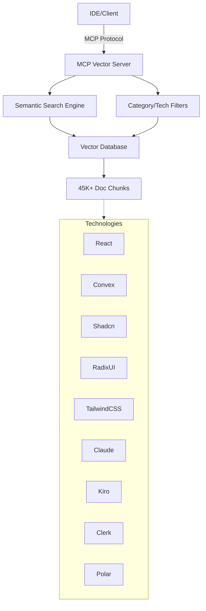

# MCP Vector Server Documentation

Welcome to the MCP Vector Server documentation. This comprehensive guide covers everything you need to know about deploying, using, and maintaining the semantic search server for technical documentation.

## 📚 Documentation Overview

### Getting Started
- [Development Setup](./development/setup.md) - Set up your local development environment
- [Project Overview](../README.md) - High-level project introduction
- [Project Summary](../PROJECT_SUMMARY.md) - Executive summary and objectives

### API Documentation
- [API Reference](./api/reference.md) - Complete MCP protocol endpoints and usage
- [Data Models](./api/models.md) - Detailed schema and data structure documentation

### Development
- [Contributing Guide](./development/contributing.md) - Development workflow and standards
- [Testing Guide](./development/testing.md) - Testing procedures and coverage requirements
- [Troubleshooting](./development/troubleshooting.md) - Common issues and solutions

### Deployment & Operations
- [Deployment Guide](../DEPLOYMENT_GUIDE.md) - Production deployment instructions
- [Security Practices](./deployment/security.md) - Security considerations and best practices
- [Maintenance Guide](../MAINTENANCE_GUIDE.md) - Ongoing maintenance procedures

## 🚀 Quick Links

### For Developers
- **First Time Setup?** Start with [Development Setup](./development/setup.md)
- **Want to Contribute?** Read the [Contributing Guide](./development/contributing.md)
- **API Integration?** Check [API Reference](./api/reference.md)

### For DevOps/Operations
- **Production Deployment?** See [Deployment Guide](../DEPLOYMENT_GUIDE.md)
- **Security Review?** Review [Security Practices](./deployment/security.md)
- **Maintenance Tasks?** Follow [Maintenance Guide](../MAINTENANCE_GUIDE.md)

## 📋 Core Features

### Semantic Search Capabilities
- Natural language query processing
- 45,000+ documentation chunks indexed
- Sub-second response times
- Context-aware ranking

### Technology Coverage
- **Frontend**: React, Shadcn/ui, RadixUI, TailwindCSS v4
- **Backend**: Convex, Clerk authentication
- **Development**: Claude Code, Kiro
- **Business**: Polar subscriptions

### Integration Points
- **IDEs**: Claude Code, Cursor, VS Code
- **Protocols**: Full MCP (Model Context Protocol) compliance
- **APIs**: RESTful endpoints with comprehensive documentation

## 🏗 Architecture Overview

## 📊 Performance Metrics

| Metric | Target | Current |
|--------|--------|---------|
| Search Response Time | < 1s | ✅ Sub-second |
| Documentation Coverage | 40K+ chunks | ✅ 45K+ chunks |
| Technology Support | 8+ stacks | ✅ 9 stacks |
| Uptime SLA | 99.9% | Production ready |
| Memory Usage | < 2GB | Optimized |

## 🔧 Configuration

The server supports flexible configuration through:
- Environment variables for sensitive data
- Configuration files for search parameters
- Runtime options for performance tuning

Key configuration areas:
- Vector database paths
- Search similarity thresholds
- Category and technology mappings
- Performance optimization settings

## 📈 Monitoring & Observability

Built-in support for:
- Request/response logging
- Performance metrics collection
- Error tracking and alerting
- Search quality analytics

## 🤝 Support & Community

- **Issues**: Report bugs via GitHub Issues
- **Discussions**: Join community discussions
- **Contributing**: See [Contributing Guide](./development/contributing.md)
- **Security**: Report vulnerabilities following [Security Practices](./deployment/security.md)

## 📝 License

This project is licensed under the MIT License. See the LICENSE file for details.

---

*Last updated: December 2024*
*Documentation version: 1.0.0*