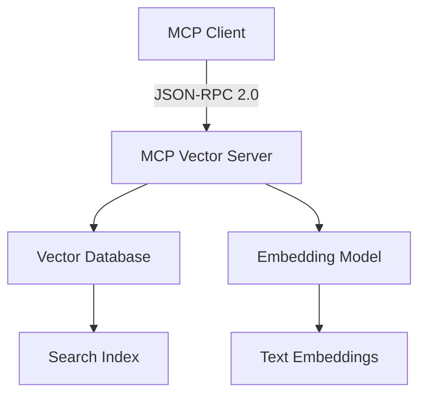

# Technical Writing Guidelines and JSON-RPC 2.0 Documentation Research

## Overview
Supplemental research on JSON-RPC 2.0 documentation best practices and technical writing guidelines for developer tools, completing the research deliverables for MCP Vector Server documentation.

## JSON-RPC 2.0 Documentation Best Practices

### 1. Specification Structure Analysis

Based on the JSON-RPC 2.0 specification (https://www.jsonrpc.org/specification):

#### Core Documentation Principles
1. **Request-Response Pattern Documentation**
   - Clear message format specifications with examples
   - Parameter validation and type information
   - Error code standardization and documentation
   - Batch processing capabilities and limitations

2. **Message Format Standards**
   - **Request Object Structure**:
     ```json
     {
       "jsonrpc": "2.0",
       "method": "method_name", 
       "params": {...},
       "id": 1
     }
     ```
   - **Response Object Structure**:
     ```json
     {
       "jsonrpc": "2.0",
       "result": {...},
       "id": 1
     }
     ```
   - **Error Object Structure**:
     ```json
     {
       "jsonrpc": "2.0",
       "error": {
         "code": -32600,
         "message": "Invalid Request"
       },
       "id": null
     }
     ```

#### Error Handling Documentation Patterns
1. **Standardized Error Codes**
   - Parse Error: -32700
   - Invalid Request: -32600  
   - Method Not Found: -32601
   - Invalid Params: -32602
   - Internal Error: -32603
   - Application-specific: -32099 to -32000

2. **Error Documentation Structure**
   - Error code table with descriptions
   - Common error scenarios with examples
   - Troubleshooting guide for each error type
   - Recovery strategies and recommendations

### 2. Method Documentation Template

For each JSON-RPC method, documentation should include:

```markdown
## Method: [method_name]

### Description
[Brief description of what the method does]

### Parameters
| Name | Type | Required | Description |
|------|------|----------|-------------|
| param1 | string | Yes | Parameter description |
| param2 | number | No | Optional parameter |

### Request Example
```json
{
  "jsonrpc": "2.0",
  "method": "method_name",
  "params": {
    "param1": "value",
    "param2": 42
  },
  "id": 1
}
```

### Response Example
```json
{
  "jsonrpc": "2.0",
  "result": {
    "data": "response_data"
  },
  "id": 1
}
```

### Error Responses
[List of possible errors with codes and examples]

### Usage Notes
[Implementation considerations and best practices]
```

## Technical Writing Guidelines for Developer Tools

### 1. Documentation Architecture Principles

#### Information Architecture
1. **User-Centered Design**
   - Identify primary user personas (developers, system integrators, end users)
   - Create user journey maps for different use cases
   - Organize content by user goals, not internal system structure

2. **Progressive Disclosure**
   - Overview ’ Quick Start ’ Detailed Reference ’ Advanced Topics
   - Each section should be self-contained but logically connected
   - Provide multiple entry points for different skill levels

3. **Discoverability and Navigation**
   - Comprehensive table of contents with clear hierarchy
   - Cross-references between related concepts
   - Search-friendly content organization
   - Visual navigation aids (breadcrumbs, section indicators)

#### Content Organization Patterns
1. **Problem-Solution Framework**
   - Start with user problems or use cases
   - Present solution overview with benefits
   - Provide step-by-step implementation
   - Include validation and troubleshooting

2. **Example-Driven Documentation**
   - Lead with practical examples before theory
   - Provide working code samples that can be copy-pasted
   - Include complete, runnable examples
   - Show common variations and edge cases

### 2. Writing Style Guidelines

#### Voice and Tone
1. **Developer-Friendly Voice**
   - Direct and concise language
   - Technical precision without unnecessary jargon
   - Conversational but professional tone
   - Assume competence but not familiarity with specific tools

2. **Clarity and Precision**
   - Use active voice: "The server returns..." not "A response is returned..."
   - Be specific: "Takes 2-5 seconds" not "Takes a few seconds"
   - Define technical terms consistently throughout documentation
   - Use parallel structure in lists and procedures

#### Content Standards
1. **Code Documentation Standards**
   - All code examples should be syntax-highlighted
   - Include language-specific examples where relevant
   - Provide context for code snippets (where they fit in larger system)
   - Comment complex code inline

2. **Procedure Documentation**
   - Use numbered lists for sequential steps
   - Include expected outcomes for each step
   - Provide screenshots or visual confirmation where helpful
   - Include time estimates for lengthy procedures

### 3. Visual Documentation Standards

#### Diagrams and Visual Aids
1. **Architecture Diagrams**
   - Use consistent symbols and colors
   - Show data flow and dependencies clearly
   - Include legends and labels
   - Keep diagrams focused on specific concepts

2. **Code Formatting Standards**
   - Consistent indentation and syntax highlighting
   - Use callouts to highlight important parts
   - Include both request and response examples
   - Show error cases alongside success cases

#### Interactive Elements
1. **Runnable Examples**
   - Provide interactive code samples where possible
   - Include "Try it" sections with live APIs
   - Show expected outputs for examples
   - Include links to full working projects

### 4. Documentation Maintenance Patterns

#### Version Management
1. **Documentation Versioning**
   - Version documentation alongside code releases
   - Maintain backward compatibility information
   - Provide migration guides for breaking changes
   - Archive old versions but keep them accessible

2. **Content Freshness**
   - Regular review cycles for accuracy
   - Automated testing of code examples
   - User feedback integration processes
   - Analytics to identify problematic content

#### Quality Assurance
1. **Editorial Standards**
   - Consistent terminology across all documentation
   - Regular proofreading and technical review
   - User testing of documentation flows
   - Accessibility compliance (WCAG guidelines)

## MCP Vector Server Specific Recommendations

### 1. JSON-RPC Method Documentation Structure

Each vector search method should document:

```markdown
## vector_search

### Description
Performs semantic similarity search across indexed documentation chunks.

### Parameters
| Name | Type | Required | Description | Example |
|------|------|----------|-------------|---------|
| query | string | Yes | Search query text | "MCP protocol setup" |
| limit | number | No | Max results (default: 10) | 5 |
| threshold | number | No | Similarity threshold (0-1) | 0.7 |

### Request Example
```json
{
  "jsonrpc": "2.0",
  "method": "vector_search",
  "params": {
    "query": "How to setup MCP server",
    "limit": 5,
    "threshold": 0.8
  },
  "id": 1
}
```

### Response Example
```json
{
  "jsonrpc": "2.0",
  "result": {
    "results": [
      {
        "content": "MCP server setup requires...",
        "similarity": 0.95,
        "metadata": {
          "source": "setup-guide.md",
          "section": "installation"
        }
      }
    ],
    "total": 1,
    "query_time_ms": 45
  },
  "id": 1
}
```

### Error Responses
| Code | Message | Cause | Solution |
|------|---------|-------|----------|
| -32602 | Invalid params | Missing query | Include query parameter |
| -32001 | Search failed | Database error | Check server logs |

### Performance Notes
- Typical response time: 50-200ms
- Batch requests supported for multiple queries
- Results cached for 5 minutes
```

### 2. Architecture Documentation Template

```markdown
# MCP Vector Server Architecture

## System Overview
The MCP Vector Server provides semantic search capabilities through the Model Context Protocol, enabling AI applications to search and retrieve relevant documentation chunks based on semantic similarity.

## Component Architecture



## Protocol Flow

1. **Connection Establishment**
   - Client connects via stdio transport
   - Server responds with capability negotiation
   - Protocol version confirmed as 2024-11-05

2. **Search Request Processing**
   - Client sends vector_search JSON-RPC request
   - Server generates embeddings for query text
   - Database performs similarity search
   - Results ranked and returned with metadata

## Security Considerations
- Input validation on all search queries
- Rate limiting for search requests
- Secure handling of embedded content
- Access control for sensitive documentation
```

### 3. Troubleshooting Guide Structure

```markdown
# Troubleshooting Guide

## Common Issues

### Connection Issues

#### "Connection refused" error
**Symptoms**: Client cannot connect to MCP server
**Diagnosis**: Check if server is running and accessible
**Solution**: 
1. Verify server process is active: `ps aux | grep mcp-vector-server`
2. Check port availability: `lsof -i :PORT`
3. Verify client configuration matches server settings

#### "Protocol version mismatch"
**Symptoms**: Capability negotiation fails
**Diagnosis**: Client/server protocol version incompatibility
**Solution**: Update client or server to compatible MCP version

### Search Issues

#### "No results found"
**Symptoms**: Valid queries return empty results
**Diagnosis**: Database index or embedding issues
**Solution**:
1. Check database status and index health
2. Verify embedding model is loaded correctly
3. Test with known indexed content

#### "Search timeout"
**Symptoms**: Queries hang or timeout
**Diagnosis**: Performance or resource issues
**Solution**:
1. Monitor server resources (CPU, memory)
2. Check database query performance
3. Consider increasing timeout values

## Performance Troubleshooting

### Slow Search Response
1. **Database Optimization**
   - Verify indexes are properly built
   - Check database connection pool settings
   - Monitor query execution plans

2. **Embedding Performance**
   - Ensure embedding model is using GPU if available
   - Check batch processing efficiency
   - Monitor memory usage during embedding

### High Memory Usage
1. **Vector Index Optimization**
   - Implement index pagination for large datasets
   - Use memory-efficient vector storage formats
   - Configure appropriate cache sizes

## Getting Help
- Check server logs: `tail -f /path/to/server.log`
- Enable debug logging: `DEBUG=1 mcp-vector-server`
- Report issues: [GitHub Issues](https://github.com/project/issues)
```

## Research Summary and Recommendations

### Key Findings
1. **JSON-RPC 2.0 Documentation** requires comprehensive method documentation with request/response examples, standardized error codes, and performance characteristics
2. **Technical Writing Best Practices** emphasize user-centered design, progressive disclosure, and example-driven documentation
3. **Developer Tool Documentation** should prioritize working examples, clear architecture diagrams, and comprehensive troubleshooting guides

### Implementation Recommendations
1. **Adopt JSON-RPC Method Template** for all vector search operations
2. **Implement Visual Documentation Standards** with Mermaid diagrams and consistent code formatting
3. **Create Comprehensive Error Documentation** with standardized codes and troubleshooting guides
4. **Establish Content Maintenance Processes** for keeping documentation current with code changes

### Next Steps for Documentation Agent
1. Use research findings to create production-ready documentation
2. Implement visual documentation standards with diagrams
3. Create interactive examples and runnable code samples
4. Establish automated testing for documentation accuracy

---

**Research Status**: Complete - All phases finished
**Deliverables**: Comprehensive research covering MCP protocol standards, vector database patterns, Claude Code integration examples, JSON-RPC 2.0 best practices, and technical writing guidelines
**Time**: 90 minutes total research time
**Files Created**: 3 comprehensive research documents
**Ready for Handoff**: Documentation agent can proceed with implementation